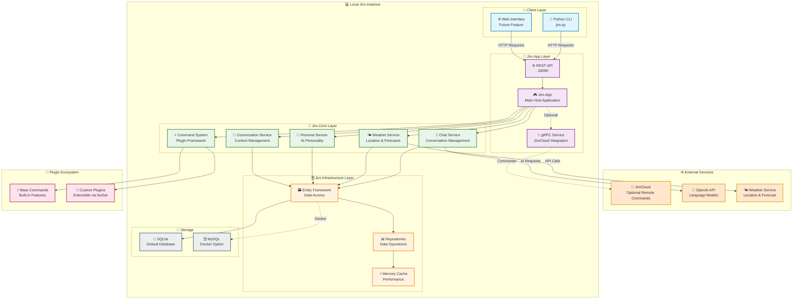

<p align="center">
    
</p>

<h1 align="center">🤖 Jiro AI Assistant</h1>

<p align="center">
    <strong>Your intelligent companion powered by AI and extensible plugins!</strong>
</p>

<p align="center">
    <a href="https://github.com/HueByte/Jiro/actions/workflows/create-release.yml">
        
    </a>
    <a href="https://github.com/HueByte/Jiro/releases/latest">
        
    </a>
    <a href="https://github.com/HueByte/Jiro/commits/main">
        
    </a>
    <a href="https://github.com/HueByte/Jiro/stargazers">
        
    </a>
    <a href="https://github.com/HueByte/Jiro/issues">
        
    </a>
    <a href="https://github.com/HueByte/Jiro/blob/main/LICENSE">
        
    </a>
    <a href="https://dotnet.microsoft.com/download">
        
    </a>
    <a href="https://github.com/HueByte/Jiro">
        
    </a>
</p>

---

## 🌟 What is Jiro?

Meet **Jiro** – your personal AI assistant that combines the power of ChatGPT with a robust, extensible plugin system! Whether you need help with daily tasks, want to check the weather, manage conversations, or build custom integrations, Jiro is here to make your life easier and more productive.

## ✨ What Makes Jiro Special?

🧠 **AI-Powered Conversations** - Leverage ChatGPT's intelligence for natural, context-aware interactions  
🔌 **Plugin Architecture** - Extend functionality with custom commands and integrations  
🌤️ **Built-in Weather** - Get real-time weather updates and forecasts  
💬 **Session Management** - Maintain conversation context across multiple interactions  
🛡️ **Secure & Private** - Your data stays secure with robust authentication  
🚀 **Modern Tech Stack** - Built with .NET 9, React, and modern web technologies  

## 🎮 Quick Demo

```bash
# Chat with Jiro
You: "What's the weather like today?"
Jiro: "🌤️ It's partly cloudy and 72°F in your area. Perfect for a walk!"

# Get help with commands
You: "/help weather"
Jiro: "Here are the weather commands I can help you with..."

# Custom plugins in action
You: "/net ping google.com"
Jiro: "🌐 Pinging google.com... Response time: 23ms ✅"
```

## 🚀 Quick Start

### Prerequisites

- [.NET 9 SDK](https://dotnet.microsoft.com/download)
- [Node.js](https://nodejs.org/) (for the web interface)
- [Python 3.8+](https://python.org/) (for tokenizer service)
- OpenAI API Key (optional, for chat features)

### 🏃‍♂️ Get Running in 5 Minutes

1. **Clone the repository**

   ```bash
   git clone https://github.com/HueByte/Jiro.git
   cd Jiro
   ```

2. **Set up configuration**

   ```bash
   # Navigate to the app directory
   cd src/Jiro.Kernel/Jiro.App
   
   # Copy example configs
   cp appsettings.example.json appsettings.json
   cd clientapp
   cp envExamples/.env.example .env
   cp envExamples/.env.development.example .env.development
   ```

3. **Configure your OpenAI key** (optional)

   ```json
   // In appsettings.json
   {
     "Gpt": {
       "AuthToken": "your-openai-api-key-here"
     }
   }
   ```

4. **Run Jiro**

   ```bash
   cd ../  # Back to Jiro.App directory
   dotnet tool restore
   dotnet run
   ```

5. **Start the tokenizer** (in a new terminal)

   ```bash
   cd src/Jiro.TokenApi
   pip install -r requirements.txt
   python main.py
   ```

6. **Open your browser** and navigate to `https://localhost:5001` 🎉

## 🔌 Plugin Development

Want to extend Jiro with your own commands? It's easier than you think!

```csharp
[Command("hello")]
public class HelloCommand : BaseCommand
{
    public override async Task<string> ExecuteAsync(string[] args)
    {
        var name = args.Length > 0 ? args[0] : "World";
        return $"Hello, {name}! 👋";
    }
}
```

📚 **Learn More**: This project demonstrates plugin architecture patterns and extensible command system design

## 🏗️ Architecture Overview

Jiro is built as a modular, self-contained AI assistant that can run locally while optionally connecting to external services. The architecture follows clean separation of concerns with a focus on extensibility and performance:



### 🔧 Architecture Components

#### **🚀 Jiro.App - Application Host**

- **Main Host**: Central application with dependency injection and configuration
- **REST API**: Primary interface on port 18090 for client communication
- **gRPC Service**: Optional integration with JiroCloud for distributed commands

#### **💡 Jiro.Core - Business Logic**

- **Chat Service**: Manages conversations and integrates with OpenAI
- **Command System**: Extensible plugin framework for adding new features
- **Weather Service**: Provides location-based weather information
- **Persona Service**: Handles AI personality and behavior customization
- **Conversation Service**: Manages chat context and message history

#### **🏗️ Jiro.Infrastructure - Data Layer**

- **Entity Framework**: ORM for database operations and migrations
- **Repositories**: Clean data access patterns with caching support
- **SQLite**: Default lightweight database, MySQL available via Docker

#### **🔌 Plugin Ecosystem**

- **Base Commands**: Built-in functionality (chat, weather, etc.)
- **Custom Plugins**: Extensible via NuGet packages and the plugin framework
- **Dynamic Loading**: Runtime discovery and registration of new commands

### 🌟 Key Architectural Benefits

- **🏠 Self-Contained**: Runs completely locally with optional cloud features
- **🔌 Extensible**: Plugin system allows easy addition of new commands
- **⚡ Performance**: Memory caching and efficient data access patterns
- **🐳 Deployable**: Docker support with MySQL for production environments
- **🛡️ Flexible**: SQLite for development, MySQL for production scaling

## 📚 Documentation

Explore our comprehensive documentation:

- **[📖 User Guide](dev/docs/)** - Get started and learn how to use Jiro
- **[🔧 API Reference](dev/api/)** - Complete technical documentation
- **[📝 Changelog](dev/docs/changelog/)** - What's new in each version

### Build Documentation Locally

```bash
# Use our handy script
./scripts/docfx-gen.sh        # Linux/macOS
scripts/docfx-gen.ps1         # Windows

# Or manually
cd dev
docfx docfx.json --serve
```

## 🐳 Docker Development

Jiro Kernel supports Docker Compose for easy development and deployment with automatic environment variable management.

### Quick Start with Docker

```bash
# 1. Copy and configure environment variables
cp .env.example .env
# Edit .env with your API keys and configuration

# 2. Start with Docker Compose (includes MySQL + Jiro Kernel)
docker-compose up -d

# 3. View logs
docker-compose logs -f jiro-kernel

# 4. Stop services
docker-compose down
```

### Environment Configuration

The Docker setup uses `.env` files for clean configuration management:

```bash
# Required Database Configuration
MYSQL_ROOT_PASSWORD=your-root-password
MYSQL_DATABASE=jiro
MYSQL_USER=jiro
MYSQL_PASSWORD=your-secure-password
DB_SERVER=mysql

# Required Application Configuration (uncomment in .env)
JIRO_ApiKey=your-api-key-here
JIRO_JiroApi=https://your-jiro-api-url

# Required for AI features (uncomment in .env)
OPENAI_API_KEY=sk-your-openai-api-key

# Required for authentication (uncomment in .env)
JWT_SECRET=your-jwt-secret-minimum-32-characters
JWT_ISSUER=Jiro
JWT_AUDIENCE=JiroUsers

# Port Configuration
JIRO_HTTP_PORT=8080
JIRO_HTTPS_PORT=8443
JIRO_ADDITIONAL_PORT=18090
MYSQL_PORT=3306

# Data Paths Configuration (optional - customize as needed)
JIRO_DataPaths__Logs=Data/Logs
JIRO_DataPaths__Database=Data/Database/jiro.db
JIRO_DataPaths__Plugins=Data/Plugins
JIRO_DataPaths__Themes=Data/Themes
JIRO_DataPaths__Messages=Data/Messages
```

### Data Organization

Jiro uses an organized Data folder structure for all application data:

```
Data/
├── Database/     # SQLite database files
├── Logs/         # Application logs (managed by Serilog)
├── Plugins/      # Plugin assemblies and configurations
├── Themes/       # Custom UI themes and styling
└── Messages/     # Markdown files for chat messages
```

**Docker Volumes**: Each Data subfolder has its own persistent volume:
- `jiro_database` → `/home/app/jiro/Data/Database`
- `jiro_logs` → `/home/app/jiro/Data/Logs`
- `jiro_plugins` → `/home/app/jiro/Data/Plugins`
- `jiro_themes` → `/home/app/jiro/Data/Themes`
- `jiro_messages` → `/home/app/jiro/Data/Messages`

**Path Customization**: All paths are configurable via environment variables using the `JIRO_DataPaths__` prefix.

### Production Deployment

- Use `docker-compose.yml` with proper `.env` configuration
- Environment variables override `.env` values for secrets management
- Persistent volumes for all data directories included
- Health checks and proper networking configured
- Organized data structure with separate volumes for each data type

## 🎓 Engineering Thesis Project

This project is developed as part of an engineering thesis focused on building a modern AI assistant platform. The project demonstrates the integration of AI technologies with clean architecture patterns and modern software engineering practices.

## 🛠️ Configuration Reference

### Core API Settings

| Setting | Description | Default |
|---------|-------------|---------|
| `urls` | Hosting URLs | `http://localhost:18090;https://localhost:18091` |
| `TokenizerUrl` | Tokenizer API endpoint | `http://localhost:8000` |
| `Gpt:AuthToken` | OpenAI API key | *Required for chat features* |
| `JWT:Secret` | JWT signing key | *Change in production!* |

### Data Paths Settings

| Setting | Description | Default |
|---------|-------------|---------|
| `DataPaths:Database` | SQLite database file path | `Data/Database/jiro.db` |
| `DataPaths:Logs` | Application logs directory | `Data/Logs` |
| `DataPaths:Plugins` | Plugin assemblies directory | `Data/Plugins` |
| `DataPaths:Themes` | UI themes directory | `Data/Themes` |
| `DataPaths:Messages` | Markdown messages directory | `Data/Messages` |

### Web Client Settings  

| Setting | Description | Default |
|---------|-------------|---------|
| `PORT` | Development server port | `3000` |
| `JIRO_API` | API proxy target | `https://localhost:18091` |

## 🎯 Roadmap

- [ ] 🧠 Enhanced AI model support (GPT-4, Claude, etc.)
- [ ] 📱 Mobile applications (iOS/Android)
- [ ] 🔊 Voice interaction capabilities
- [ ] 🌐 Multi-language support
- [ ] 📊 Analytics and usage insights
- [ ] 🤖 Automated plugin marketplace
- [ ] 🔗 Third-party service integrations (Discord, Slack, etc.)

## 💖 Support the Project

If you find this engineering thesis project interesting:

- ⭐ **Star this repository** to show your support
- 🐛 **Report issues** if you find any bugs
- 💬 **Share feedback** on the implementation approach

## 📄 License

This project is licensed under the MIT License - see the [LICENSE](LICENSE) file for details.

## 🙏 Acknowledgments

- 🤖 **OpenAI** for the powerful GPT models
- 🚀 **Microsoft** for the amazing .NET ecosystem
- ❤️ **The open-source community** for inspiration and support

---

<p align="center">
    <strong>Ready to meet your new AI assistant? <a href="#-quick-start">Get Started</a> | <a href="dev/docs/">Read the Docs</a> | <a href="https://github.com/HueByte/Jiro/issues">Get Help</a></strong>
</p>

<p align="center">
    Made with ❤️ by <a href="https://github.com/HueByte">HueByte</a>
</p>
