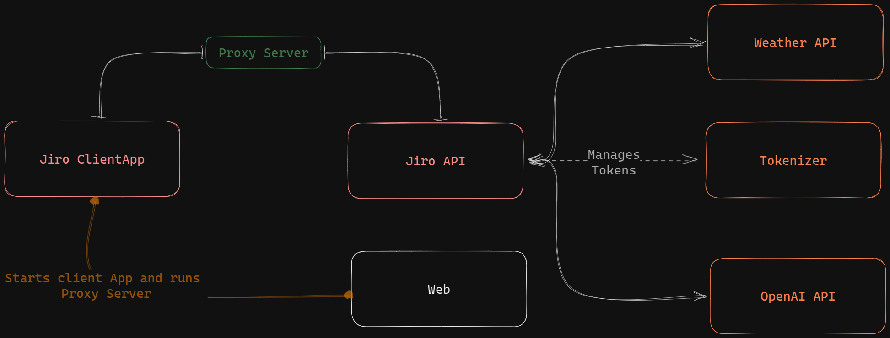

<p align="center">
    
</p>

# ✨ `Jiro`

## Virtual Assistant powered by ChatGPT and custom code integration!

This combination of ChatGPT's powerful AI capabilities and custom plugins enables Jiro to provide a wide range of services and support, including answering questions, assisting with tasks, providing recommendations, and much more. Whether users need help with work, school, or just day-to-day life, Jiro is there to lend a helping hand.

# ⚗️ Dev

## `Plugin creation`

To create plugins, refer to [github](https://github.com/HueByte/Jiro.Libs) <https://www.nuget.org/packages/Jiro.Commands/>

## `Requirements`

- dotnet SDK
- Python
- Node
- OpenAI account (Optional | Required for chat)

## 📚 Documentation

For comprehensive documentation, visit our [DocFX documentation site](generated/index.html) or build it locally:

```bash
# Build documentation
docfx docfx.json

# Build and serve documentation locally
docfx docfx.json --serve
```

The documentation includes:

- **[Documentation](generated/docs/)** - Project guides, architecture, and user documentation
- **[API Reference](generated/api/)** - Complete .NET API documentation generated from source code

## How to run

### **Jiro API & Client**

1. navigate to `src/Jiro.Kernel/Jiro.App/clientapp/envExamples` and rename example files to `.env` and `.env.development`
2. move these renamed files to `src/Jiro.Kernel/Jiro.App/clientapp`
3. navigate to `src/Jiro.Kernel/Jiro.App`
4. rename `appsettings.example.json` to `appsettings.json`
5. Configure `appsettings.json`, especially `Gpt:AuthToken` for enabling conversations (can be obtained from <https://platform.openai.com/account/api-keys>)
6. run `dotnet tool restore`
7. run `dotnet run`
8. to run Client App, open the web app (by default `https://localhost:5001`) and wait for proxy to start

### **Jiro Tokenizer API**

1. navigate to `src/Jiro.TokenApi`
2. run `pip install -r requirements.txt`
3. run `python main.py` or `uvicorn main:app --reload`

> You can change the port either via running it with `python main.py` and modifying `config.json` or by specifying `--host` and `--port` args for `uvicorn`

## Base Dev Flow of Jiro



## Important configs

The default configs should assure that Jiro will run.<br />
If you want to run apps on your own custom urls and configs, this might be useful for you

### API

> appsettings.json

| Key | Description | Default Value |
| --- | --- | --- |
| urls | The urls used for Jiro hosting | `http://localhost:18090;https://localhost:18091` |
| TokenizerUrl | The url for tokenizer API | `http://localhost:8000` |
| GPT:BaseUrl | The url for OpenAI API | `https://api.openai.com/v1/` |
| GPT:AuthToken | The Authorization token for GPT | *Obtain it from <https://platform.openai.com/account/api-keys> |
| JWT:Secret | The key used for JWT generation, should not be keep as default! | ThisIsYourSecretKeyThatYouShouldChange |

### Web

Read more about it [ASP.NET Core SPA services](https://learn.microsoft.com/en-us/aspnet/core/client-side/spa/intro?view=aspnetcore-7.0)

> Properties/launchSettings.json (for VisualStudio)

| Key | Description | Default Value |
| --- | --- | --- |
| profiles:Jiro.Client:applicationUrl | The urls used for web server | `http://localhost:18090;https://localhost:18091` |

> clientapp/.env

| Key | Description | Default Value |
| --- | --- | --- |
| JIRO_API | url for proxy that targets API server | <https://localhost:18091> |

> clientapp/.env.development

| Key | Description | Default Value |
| --- | --- | --- |
| PORT | url that client app will run on | 3000 |

> Jiro.Client.csproj

| Key | Description | Default Value |
| --- | --- | --- |
| SpaProxyServerUrl | url that's used for running client app | <https://localhost:3000> |

### Matching values

- (API)`TokenizerUrl` must match url configured for Tokenizer API
- (API)`SpaProxyServerUrl` must match resulting url from (clientapp)`PORT`
- (clientapp)`JIRO_API` must match one of the urls configured in (API)`urls`
