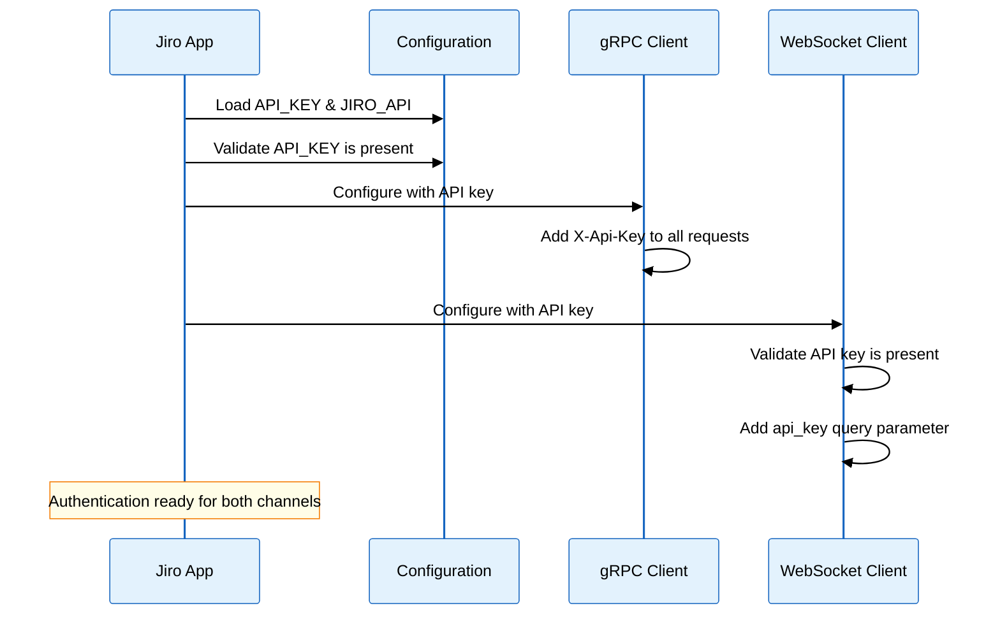
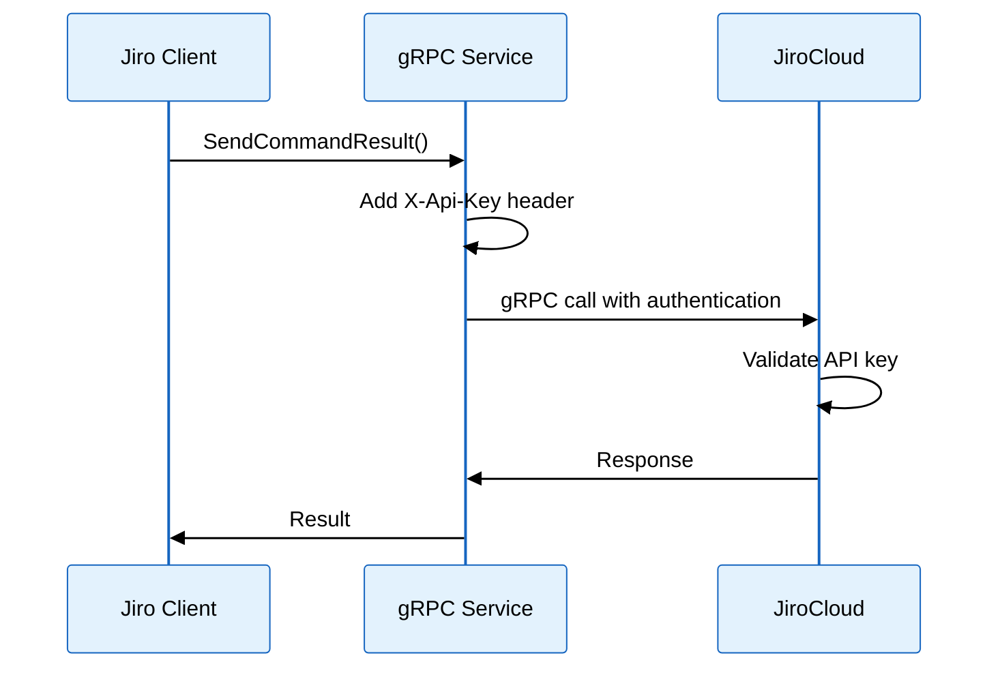
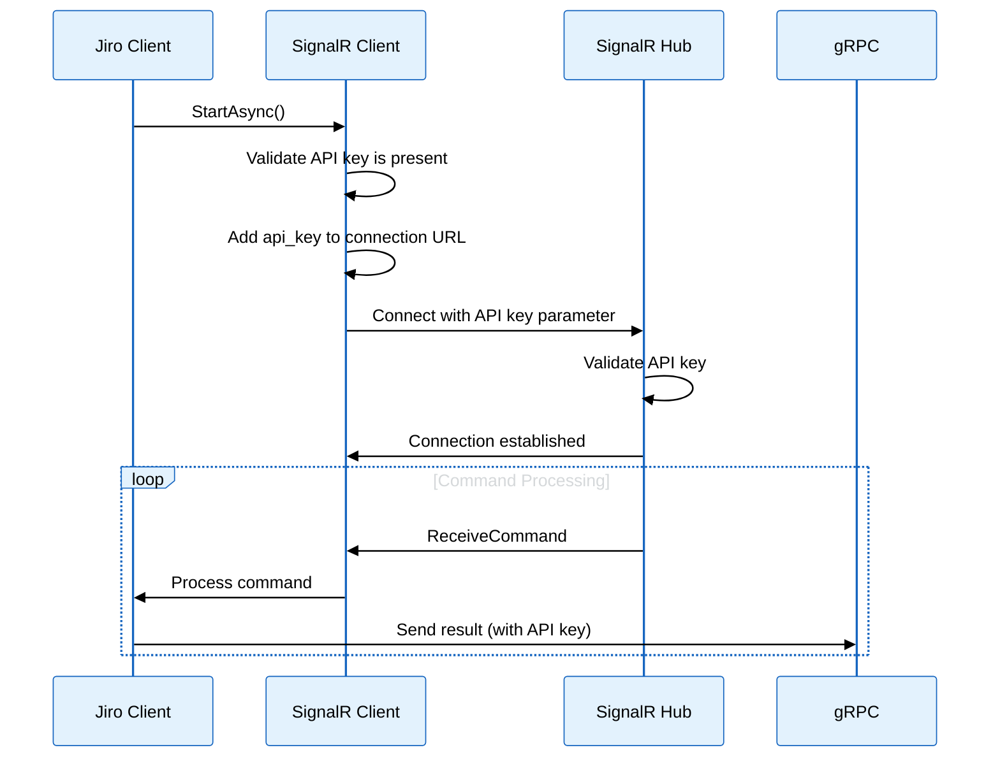

# 🔐 Client-Side Authentication Guide

This document explains how the Jiro client authenticates with JiroCloud API through both gRPC and WebSocket connections using a **single API key**.

## 🏗️ Implementation Overview

The Jiro client uses **unified API key authentication** for both communication channels:

### 🚀 gRPC Client Authentication

**Location**: `src/Jiro.Kernel/Jiro.App/Program.cs` (lines 75-82)

```csharp
services.AddGrpcClient<JiroHubProto.JiroHubProtoClient>("JiroClient", options =>
{
    options.Address = new Uri(apiUrl);
})
.AddCallCredentials((context, metadata) =>
{
    metadata.Add("X-Api-Key", apiKey);
    return Task.CompletedTask;
})
```

**Features**:

- ✅ Automatically attaches `X-Api-Key` header to all gRPC requests
- ✅ Uses global API key from configuration
- ✅ Supports both test mode and production authentication

### 📡 WebSocket (SignalR) Authentication

**Location**: `src/Jiro.Kernel/Jiro.App/Services/SignalRWebSocketConnection.cs` (lines 78-86)

```csharp
// Ensure API key is provided for authentication
if (string.IsNullOrEmpty(_options.ApiKey))
{
    throw new InvalidOperationException("API key is required for WebSocket authentication. Please configure 'WebSocket:ApiKey' or 'API_KEY' in your settings.");
}

// Build the hub URL with API key query parameter
string hubUrl = _options.HubUrl;
var separator = hubUrl.Contains('?') ? "&" : "?";
hubUrl = $"{hubUrl}{separator}api_key={Uri.EscapeDataString(_options.ApiKey)}";
```

**Features**:

- ✅ **Required** API key authentication via `api_key` query parameter
- ✅ Automatic fallback to global `API_KEY` configuration
- ✅ Allows custom headers for additional configuration
- ✅ Automatic reconnection with authentication persistence
- ✅ Fail-fast validation if API key is missing

## ⚙️ Configuration

### Unified Configuration File

**`appsettings.example.json`** - Single configuration file for all settings:

```json
{
  "TokenizerUrl": "http://localhost:8000",
  "ConnectionStrings": {
    "JiroContext": ""
  },
  "Whitelist": true,
  "Gpt": {
    "Enable": true,
    "BaseUrl": "https://api.openai.com/v1/",
    "AuthToken": "YourOpenAiToken",
    "Organization": "",
    "FineTune": false,
    "UseChatGpt": true,
    "ChatGpt": {
      "SystemMessage": "I want you to act as personal assistant called Jiro. You are friendly, funny and sarcastic. You can ask me anything you want and engage in conversation."
    },
    "SingleGpt": {
      "TokenLimit": 500,
      "ContextMessage": "User$ ",
      "Stop": "Jiro$ ",
      "Model": "text-davinci-003"
    }
  },
  "Modules": {},
  "RequiredModules": {},
  "ApiKey": "your-api-key-here",
  "JiroApi": "https://localhost:18092",
  "WebSocket": {
    "HubUrl": "https://localhost:5001/instanceHub",
    "ReconnectionDelayMs": 5000,
    "MaxReconnectionAttempts": 5,
    "HandshakeTimeoutMs": 15000,
    "KeepAliveIntervalMs": 15000,
    "ServerTimeoutMs": 30000,
    "ApiKey": "your-api-key-here",
    "Headers": {
      "User-Agent": "Jiro-Bot/1.0"
    }
  },
  "Grpc": {
    "ServerUrl": "https://localhost:5001",
    "TimeoutMs": 30000,
    "MaxRetries": 3
  }
}
```

### Environment Variables

The system reads authentication credentials from:

1. **API_KEY**: Used for both gRPC and WebSocket authentication
2. **JIRO_API**: Base URL for the JiroCloud API

### Configuration Priority

1. **WebSocket:ApiKey** (if specified in WebSocket section)
2. **API_KEY** (global fallback)
3. **Validation error** (if neither is provided)

## 🔄 Authentication Flow

### 1. Application Startup



### 2. Request Authentication

#### gRPC Requests



#### WebSocket Connection



## 🛡️ Security Best Practices

### ✅ Already Implemented

1. **Unified Authentication**: Single API key for both gRPC and WebSocket channels
2. **Required Validation**: Application fails fast if API key is missing
3. **Environment Support**: Supports both development and production credentials
4. **Git Exclusion**: Sensitive configuration files excluded from version control
5. **Connection Security**: HTTP/2 with keep-alive for efficient secure connections
6. **Automatic Retry**: Built-in retry mechanisms with authentication persistence

### 🔧 Configuration Security

1. **Use Environment Variables** in production:

   ```bash
   export API_KEY="your-production-api-key"
   export JIRO_API="https://production-jiro-cloud.com"
   ```

2. **Secure API Key Storage**:

   ```json
   {
     "ApiKey": "$(JIRO_API_KEY)"
   }
   ```

3. **Rotate Credentials Regularly**: Update API keys periodically

## 🚨 Troubleshooting

### Authentication Failures

1. **Missing API Key**:

   ```text
   Error: "Please provide API_KEY" 
   Error: "API key is required for WebSocket authentication"
   ```

   **Solution**: Set `API_KEY` environment variable or add it to `appsettings.json`

2. **Invalid API Key**:

   ```text
   Error: gRPC authentication failed
   Error: WebSocket connection failed with 401 Unauthorized
   ```

   **Solution**: Verify your API key is correct and has proper permissions

3. **Configuration Not Found**:

   ```text
   Error: "Couldn't connect to API"
   ```

   **Solution**: Ensure `JIRO_API` environment variable is set

### Testing Authentication

Use the test mode to verify authentication setup:

```bash
dotnet run --test-mode
```

This will use dummy credentials for testing the authentication flow.

## 📝 Quick Setup

To set up authentication for your Jiro client:

1. ✅ **Get your API key** from JiroCloud dashboard
2. ✅ **Set environment variable**: `API_KEY="your-api-key-here"`
3. ✅ **Set API URL**: `JIRO_API="https://your-jiro-cloud.com"`
4. ✅ **Run the application** - authentication will work automatically

**Alternative**: Copy `appsettings.example.json` to `appsettings.json` and fill in your API key.

The system handles all the complexity of attaching credentials to requests, managing connections, and handling authentication failures with retries. **No separate token or additional configuration files needed!**
