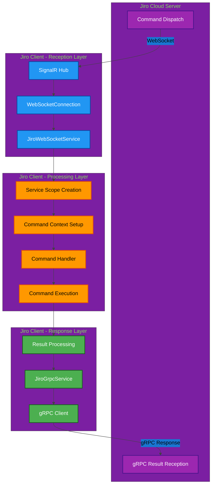
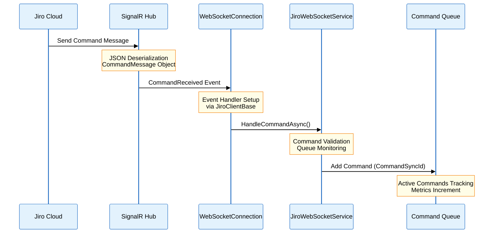
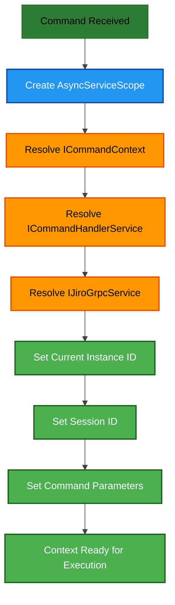
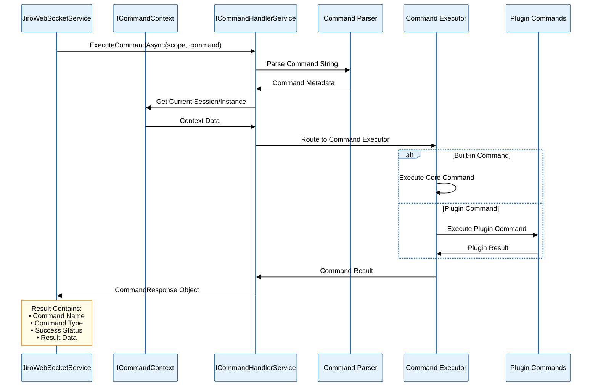
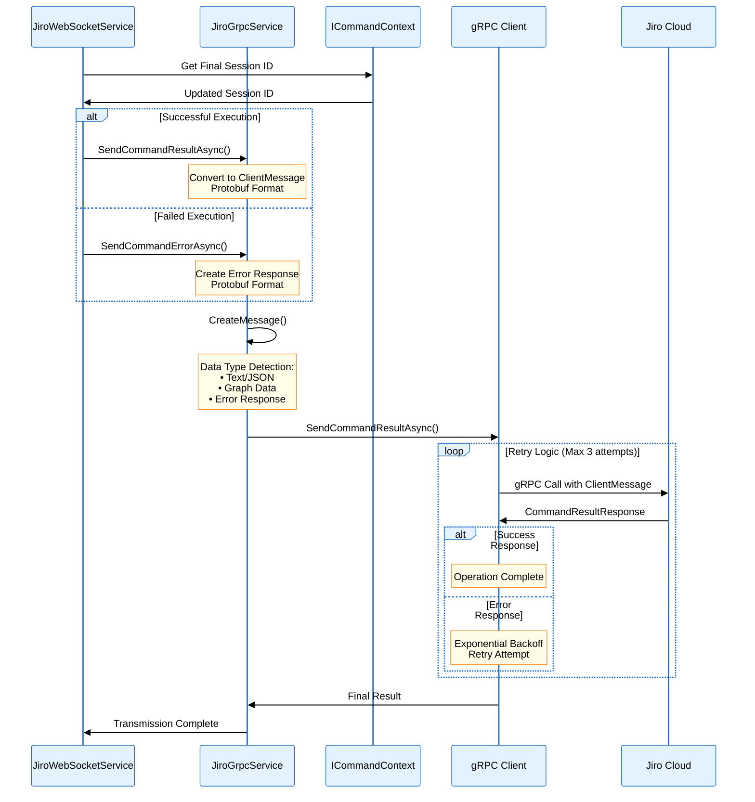
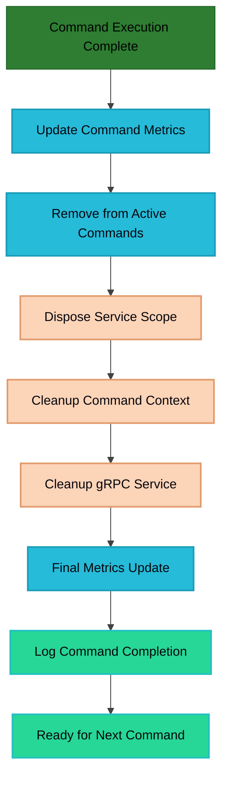
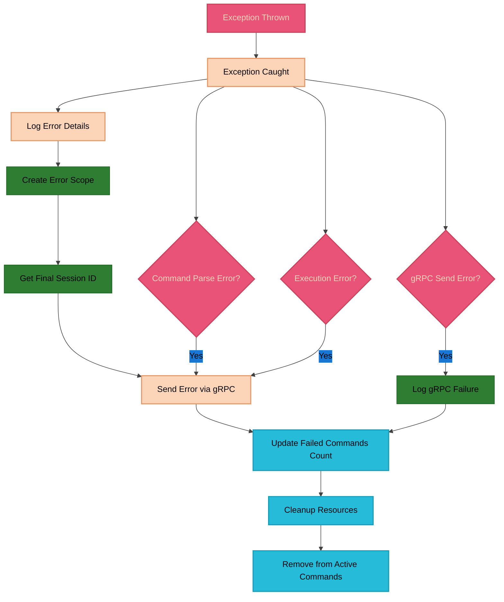
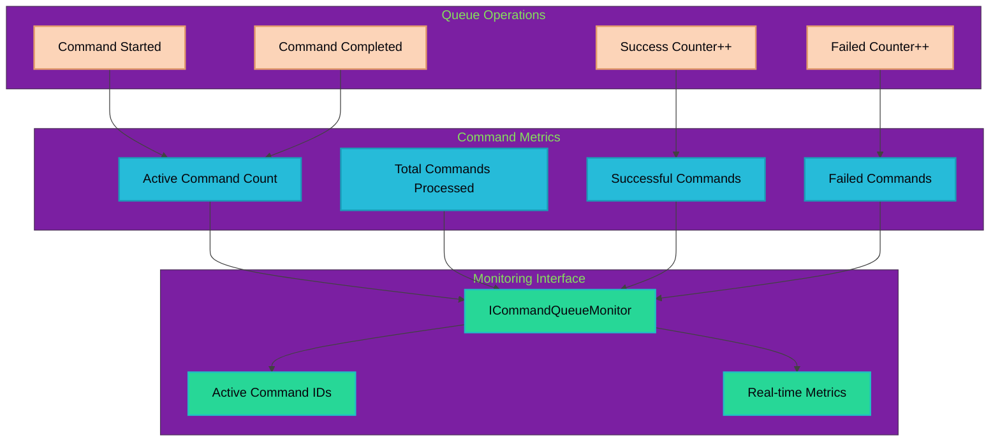
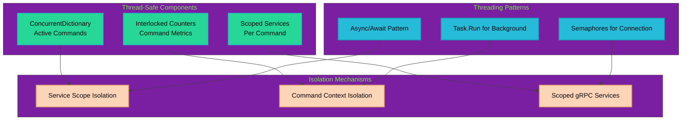

# Command Flow Architecture

## Overview

Jiro implements a sophisticated command execution pipeline that handles command processing from reception through completion. This document details the complete command flow, from initial WebSocket reception through gRPC result transmission, including all intermediate processing steps and error handling mechanisms.

### Key Updates (v1.0.0-beta)
- **Client-side session ID generation**: Sessions are now created on the client side
- **Enhanced error handling**: Improved command synchronization and error recovery
- **Service separation**: SessionManager and MessageCacheService now handle session/message operations
- **Improved WebSocket contracts**: Using `IJiroInstance` interface for better type safety

## Command Flow Pipeline

### High-Level Flow



## Detailed Command Execution Flow

### 1. Command Reception Phase



#### Command Message Structure

The incoming command follows this structure:

```typescript
interface CommandMessage {
  instanceId: string;        // Target Jiro instance identifier
  command: string;           // Command text to execute
  commandSyncId: string;     // Unique synchronization identifier
  sessionId: string;         // Chat session identifier (client-generated in v1.0.0-beta)
  parameters: Record<string, string>; // Additional command parameters
}
```

### 2. Service Scope and Context Setup



#### Context Configuration Details

```csharp
// Command context setup in JiroWebSocketService
commandContext.SetCurrentInstance(commandMessage.InstanceId);
commandContext.SetSessionId(commandMessage.SessionId);
commandContext.SetData(commandMessage.Parameters.Select(kvp =>
    new KeyValuePair<string, object>(kvp.Key, kvp.Value)));
```

### 3. Command Execution Phase



#### Command Processing Pipeline

1. **Command Parsing**: Text command parsed into executable format
2. **Command Resolution**: Determine target command handler (core vs plugin)
3. **Context Injection**: Current session and instance data provided
4. **Command Execution**: Actual business logic execution
5. **Result Formatting**: Output formatted for transmission

### 4. Result Processing and Transmission



#### Protobuf Message Structure

The result is converted to this protobuf structure:

```protobuf
message ClientMessage {
    string commandSyncId = 6;
    string commandName = 1;
    string sessionId = 8;
    DataType dataType = 2;
    bool isSuccess = 5;
    oneof result {
        TextResult textResult = 3;
        GraphResult graphResult = 4;
    }
}

enum DataType {
    TEXT = 0;
    GRAPH = 1;
}

message TextResult {
    string response = 1;
    TextType textType = 2;
}

enum TextType {
    PLAIN = 0;
    JSON = 1;
    BASE64 = 2;
    MARKDOWN = 3;
    HTML = 4;
}
```

### 5. Resource Cleanup and Monitoring



## Error Handling Flow

### Exception Processing Pipeline



### Error Response Structure

```csharp
// Error response creation in JiroGrpcService
var errorResult = new CommandResponse
{
    CommandName = "Error",
    CommandType = Jiro.Commands.CommandType.Text,
    IsSuccess = false,
    Result = Jiro.Commands.Results.TextResult.Create(errorMessage)
};
```

## Command Queue Monitoring

### Real-time Metrics Tracking



### Metrics Implementation

```csharp
// Command queue monitoring in JiroWebSocketService
private readonly ConcurrentDictionary<string, DateTime> _activeCommands = new();
private long _totalCommandsProcessed = 0;
private long _successfulCommands = 0;
private long _failedCommands = 0;

// Metrics properties
public int ActiveCommandCount => _activeCommands.Count;
public IEnumerable<string> ActiveCommandIds => _activeCommands.Keys;
public long TotalCommandsProcessed => _totalCommandsProcessed;
public long SuccessfulCommands => _successfulCommands;
public long FailedCommands => _failedCommands;
```

## Concurrency and Threading

### Thread Safety Considerations



### Concurrent Command Processing

- **Multiple Commands**: Can process multiple commands simultaneously
- **Thread Isolation**: Each command gets its own service scope and context
- **Resource Safety**: Thread-safe collections and atomic operations
- **Connection Management**: Semaphores protect WebSocket connection operations

## Performance Characteristics

### Processing Metrics

| Metric | Typical Value | Notes |
|--------|---------------|-------|
| Command Reception Latency | < 10ms | WebSocket to service handler |
| Service Scope Creation | < 5ms | Dependency injection overhead |
| Command Execution Time | Variable | Depends on command complexity |
| gRPC Transmission Time | 10-100ms | Network dependent |
| Resource Cleanup Time | < 5ms | Service scope disposal |

### Scalability Considerations

1. **Memory Usage**: Scoped services prevent memory leaks
2. **Connection Limits**: Single WebSocket, multiple gRPC calls
3. **Command Throughput**: Limited by command execution time
4. **Error Recovery**: Automatic retry and reconnection mechanisms
5. **Resource Management**: Proper disposal patterns throughout

## Integration Points

### Command Handler Integration

```csharp
// Custom command handler registration
services.RegisterCommands(nameof(ChatCommand.Chat));

// Command execution flow
var result = await _commandHandler.ExecuteCommandAsync(
    scope.ServiceProvider, 
    commandMessage.Command);
```

### Context Provider Integration

```csharp
// Command context setup
commandContext.SetCurrentInstance(commandMessage.InstanceId);
commandContext.SetSessionId(commandMessage.SessionId);
commandContext.SetData(commandMessage.Parameters.Select(kvp =>
    new KeyValuePair<string, object>(kvp.Key, kvp.Value)));
```

### gRPC Service Integration

```csharp
// gRPC client configuration
services.AddGrpcClient<JiroHubProtoClient>("JiroClient", options =>
{
    options.Address = new Uri(jiroCloudOptions.Grpc.ServerUrl);
})
.AddCallCredentials((context, metadata) =>
{
    metadata.Add("X-Api-Key", jiroCloudOptions.ApiKey);
    return Task.CompletedTask;
});
```

## Best Practices

### Command Flow Optimization

1. **Minimize Scope Lifetime**: Create and dispose service scopes quickly
2. **Async All the Way**: Use async/await throughout the pipeline
3. **Error Boundary**: Catch exceptions at the service boundary
4. **Resource Cleanup**: Always dispose scoped services properly
5. **Monitoring Integration**: Track metrics at key pipeline points

### Error Handling Guidelines

1. **Graceful Degradation**: Continue processing other commands on failures
2. **Comprehensive Logging**: Log at each major pipeline stage
3. **Retry Logic**: Implement exponential backoff for transient failures
4. **Context Preservation**: Maintain command context through error flows
5. **Cleanup Guarantee**: Ensure resources are cleaned up even on errors

This command flow architecture provides a robust, scalable, and maintainable pipeline for processing commands in the Jiro application, with comprehensive error handling, monitoring, and resource management capabilities.
