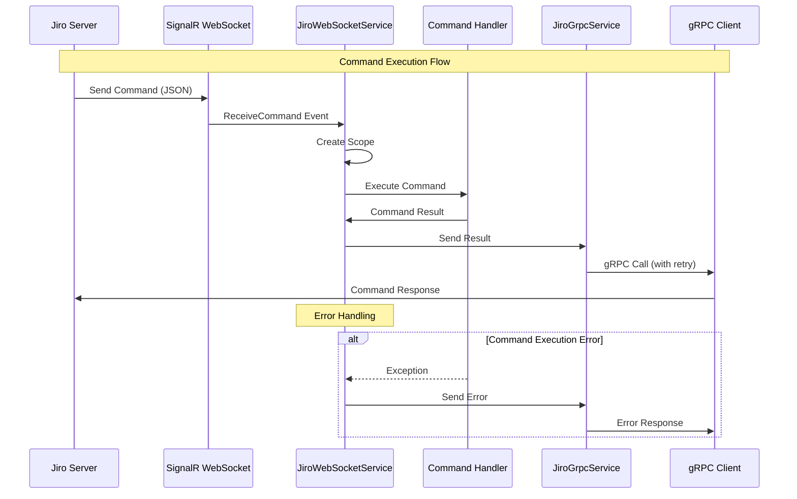
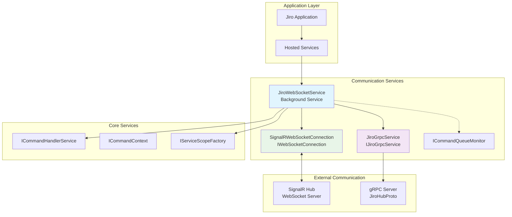
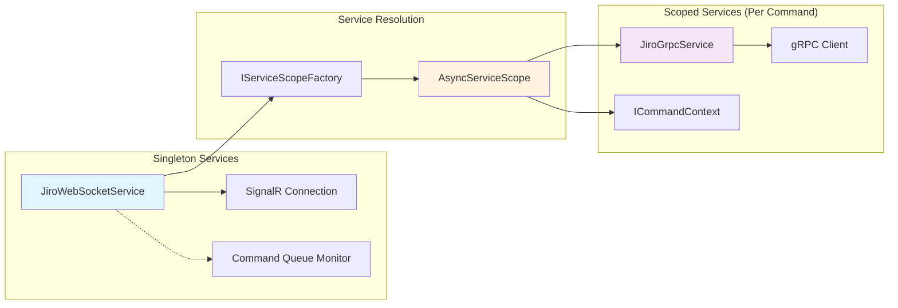
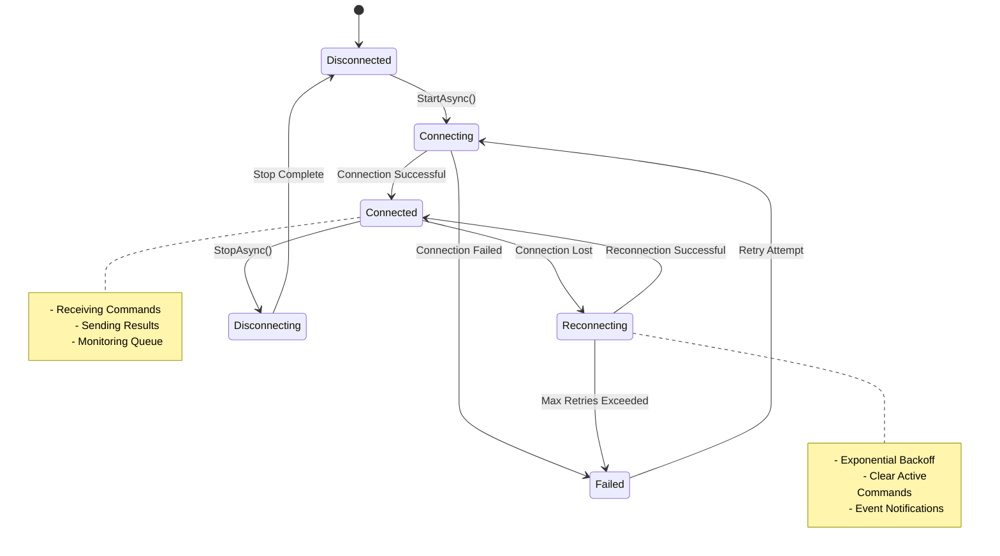
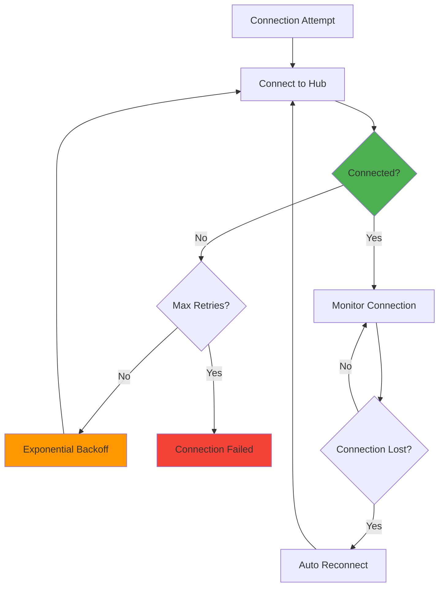
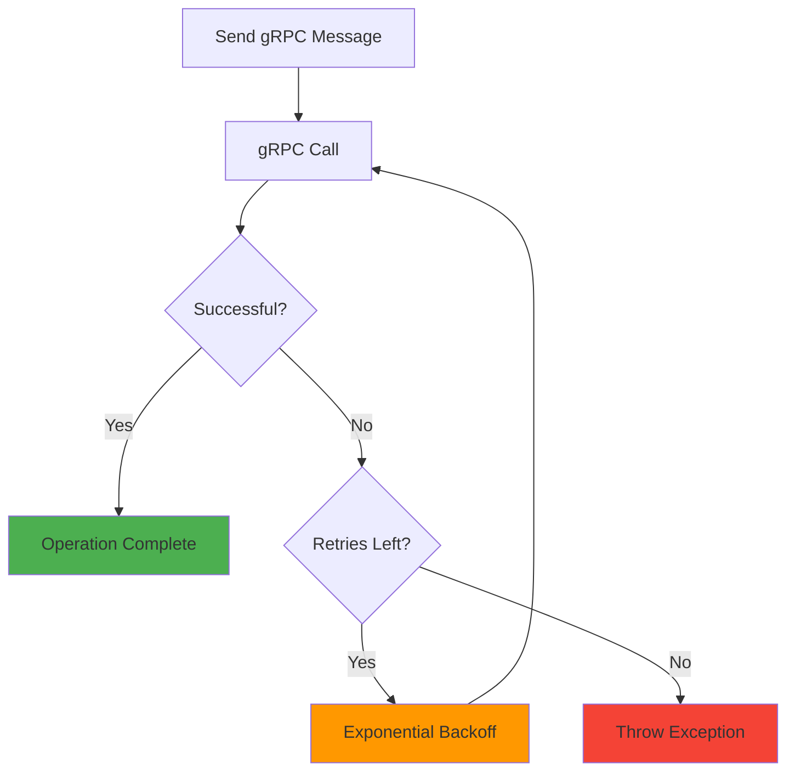
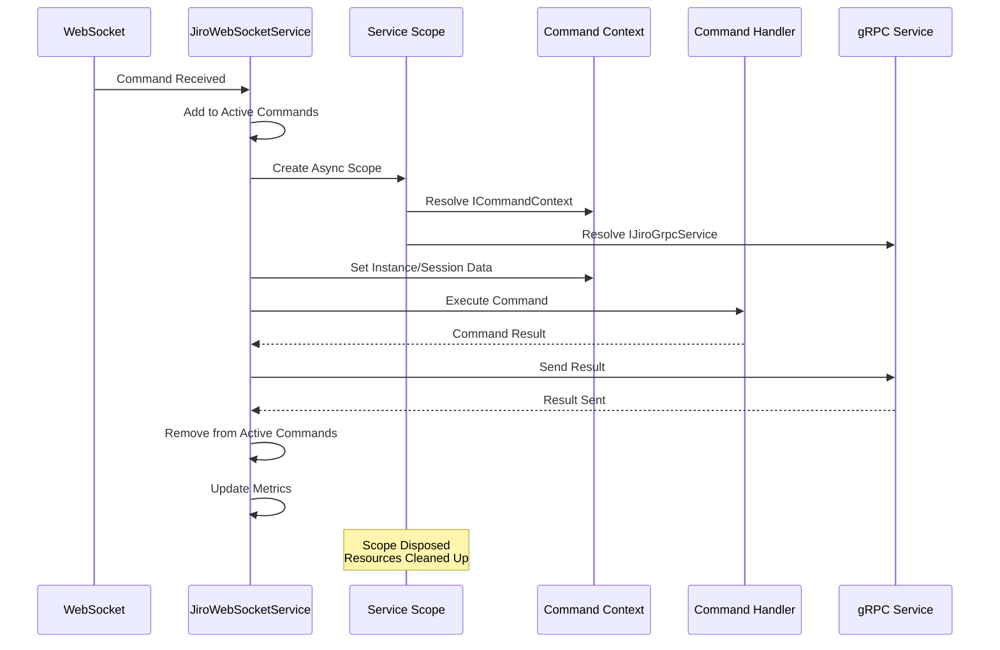

# WebSocket Communication Architecture

## Overview

Jiro implements a hybrid communication architecture that combines WebSocket connections for receiving commands and gRPC for sending command results. This design provides real-time command reception through SignalR WebSockets while ensuring reliable command result delivery via gRPC with retry mechanisms.

## Architecture Components

### Core Services

- **`JiroWebSocketService`**: Main orchestration service managing the entire communication lifecycle
- **`SignalRWebSocketConnection`**: WebSocket implementation using SignalR for real-time command reception
- **`JiroGrpcService`**: gRPC client service for sending command results back to the server
- **`ICommandQueueMonitor`**: Interface for monitoring command execution metrics

## Communication Flow



## Service Architecture



## Dependency Injection and Scoping



## Message Flow and Data Structures

### Command Message Structure

```json
{
  "instanceId": "user-123",
  "command": "chat Hello Jiro",
  "commandSyncId": "cmd-456-789",
  "sessionId": "session-abc",
  "parameters": {
    "key1": "value1",
    "key2": "value2"
  }
}
```

### Command Response Structure (gRPC)

```protobuf
message ClientMessage {
    string commandName = 1;
    CommandType commandType = 2;
    oneof result {
        TextResult textResult = 3;
        GraphResult graphResult = 4;
    }
    bool isSuccess = 5;
    string commandSyncId = 6;
}
```

## Connection Management



## Error Handling and Retry Logic

### WebSocket Connection Retry



### gRPC Result Sending Retry



## Configuration

### WebSocket Configuration

```json
{
  "WebSocket": {
    "HubUrl": "https://localhost:5001/instanceHub",
    "ReconnectionDelayMs": 5000,
    "MaxReconnectionAttempts": 5,
    "HandshakeTimeoutMs": 15000,
    "KeepAliveIntervalMs": 15000,
    "ServerTimeoutMs": 30000,
    "AccessToken": null,
    "Headers": {
      "User-Agent": "Jiro-Bot/1.0"
    }
  }
}
```

### gRPC Configuration

```json
{
  "Grpc": {
    "ServerUrl": "https://localhost:5001",
    "TimeoutMs": 30000,
    "MaxRetries": 3
  }
}
```

## Service Registration

The communication services are registered in the DI container as follows:

```csharp
// Configure options
services.Configure<WebSocketOptions>(configuration.GetSection("WebSocket"));
services.Configure<GrpcOptions>(configuration.GetSection("Grpc"));

// Register scoped gRPC service (per command execution)
services.AddScoped<IJiroGrpcService, JiroGrpcService>();

// Register singleton WebSocket connection
services.AddSingleton<IWebSocketConnection, SignalRWebSocketConnection>();

// Register main orchestration service as hosted service
services.AddHostedService<JiroWebSocketService>();

// Register command queue monitoring interface
services.AddSingleton<ICommandQueueMonitor, JiroWebSocketService>();
```

## Command Execution Lifecycle



## Command Queue Monitoring

The `ICommandQueueMonitor` interface provides real-time insights into command execution:

### Monitoring Metrics

- **Active Command Count**: Number of currently executing commands
- **Active Command IDs**: List of command synchronization IDs being processed
- **Total Commands Processed**: Lifetime count of processed commands
- **Successful Commands**: Count of successfully completed commands
- **Failed Commands**: Count of commands that resulted in errors

### Usage Example

```csharp
public class MonitoringController : ControllerBase
{
    private readonly ICommandQueueMonitor _monitor;
    
    [HttpGet("status")]
    public IActionResult GetStatus()
    {
        return Ok(new
        {
            ActiveCommands = _monitor.ActiveCommandCount,
            TotalProcessed = _monitor.TotalCommandsProcessed,
            SuccessRate = _monitor.SuccessfulCommands / (double)_monitor.TotalCommandsProcessed
        });
    }
}
```

## Key Benefits

### Architecture Advantages

1. **Real-time Communication**: WebSocket provides instant command delivery
2. **Reliable Result Delivery**: gRPC ensures command results reach the server
3. **Automatic Reconnection**: Built-in reconnection logic for WebSocket connections
4. **Retry Mechanisms**: Exponential backoff for both WebSocket and gRPC operations
5. **Proper Resource Management**: Scoped services ensure proper cleanup per command
6. **Monitoring and Observability**: Built-in command queue monitoring
7. **Error Resilience**: Comprehensive error handling at all levels

### Performance Characteristics

- **Low Latency**: Direct WebSocket connection for command reception
- **High Reliability**: gRPC with retry logic for result delivery
- **Resource Efficient**: Scoped dependency injection prevents resource leaks
- **Concurrent Processing**: Multiple commands can be processed simultaneously
- **Graceful Degradation**: System continues operating during temporary network issues

## Integration Points

### Server-Side Integration

The server must implement:

- SignalR Hub with `ReceiveCommand` method
- gRPC service implementing `JiroHubProto` service
- Proper authentication and authorization mechanisms

### Client Command Processing

Commands flow through the following pipeline:

1. WebSocket reception via SignalR
2. JSON deserialization to `CommandMessage`
3. Service scope creation for dependency injection
4. Command context setup with instance and session data
5. Command execution via `ICommandHandlerService`
6. Result serialization and gRPC transmission
7. Resource cleanup and metrics updating

This architecture provides a robust, scalable, and maintainable communication layer for the Jiro application.
