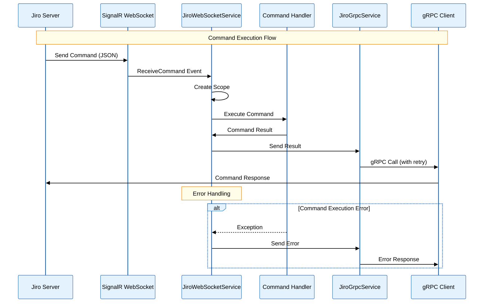
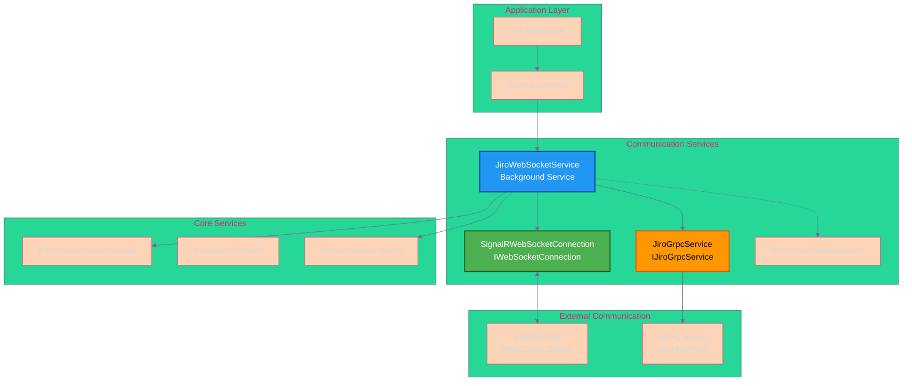
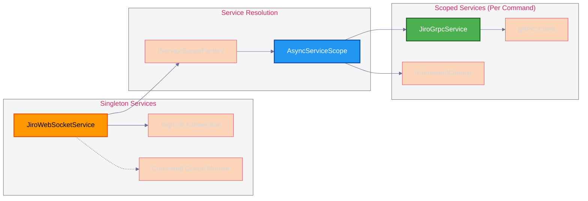
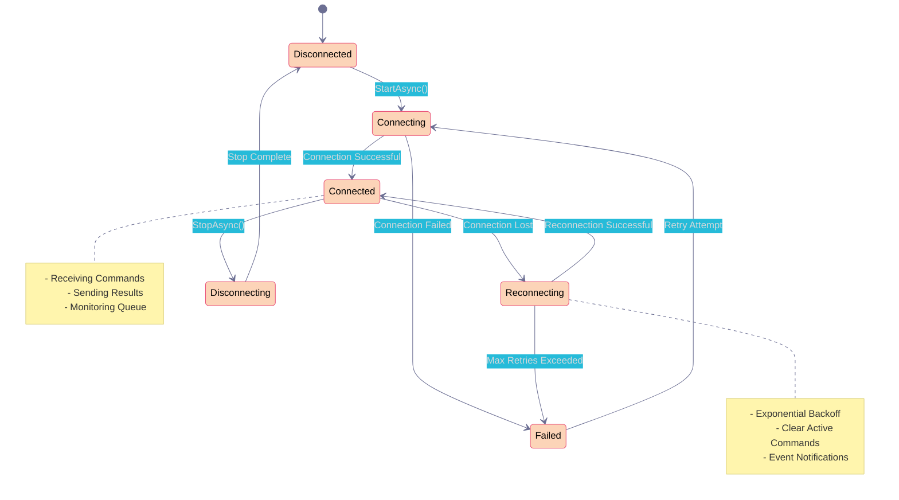
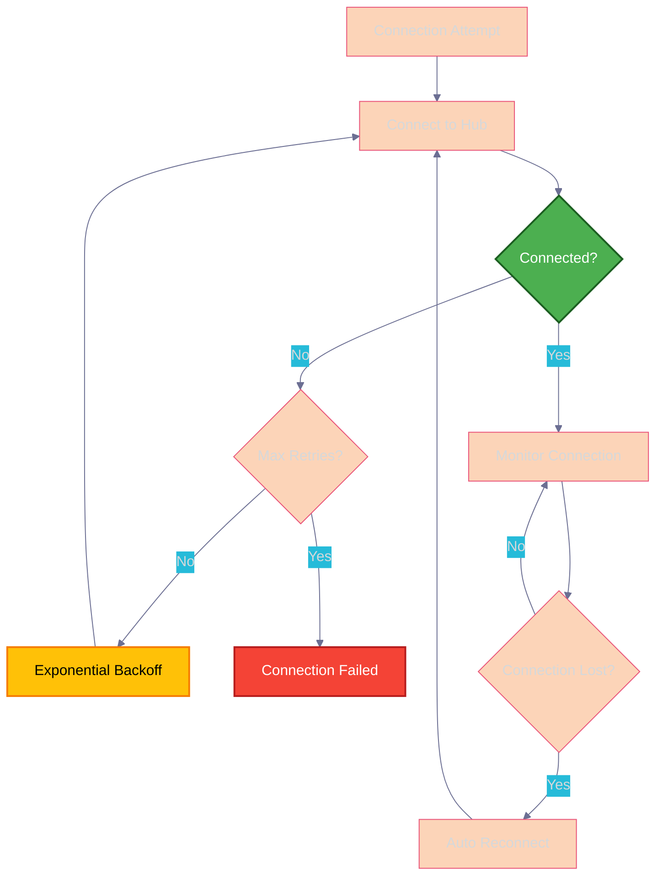
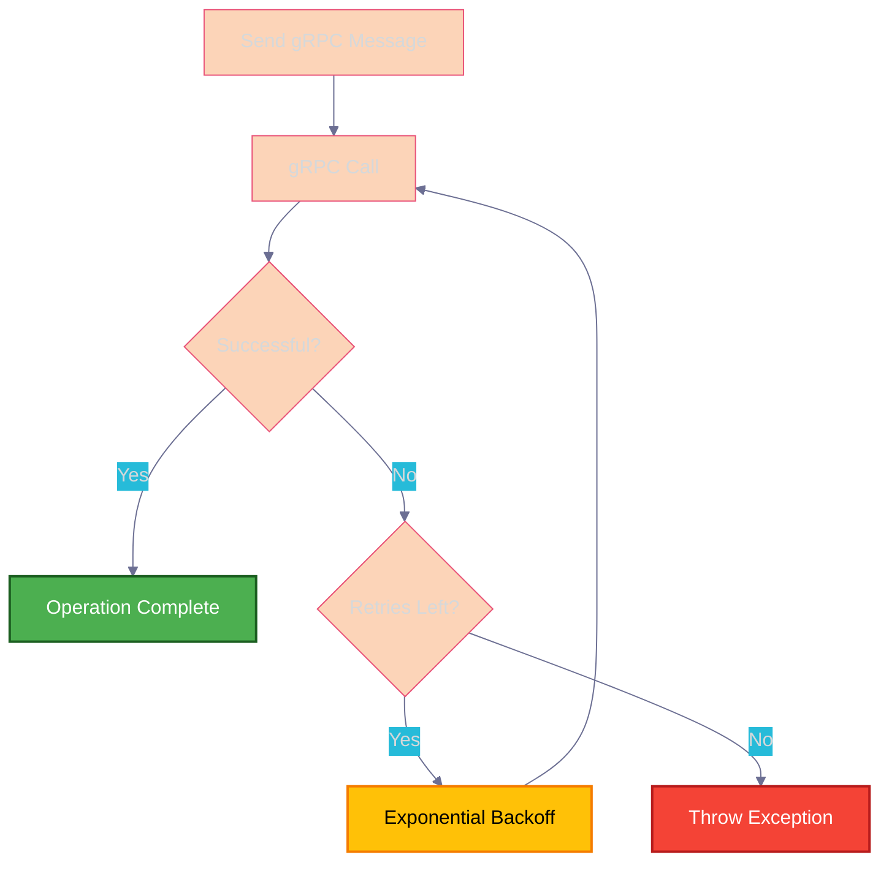
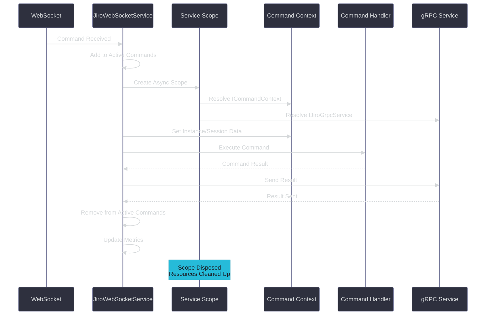
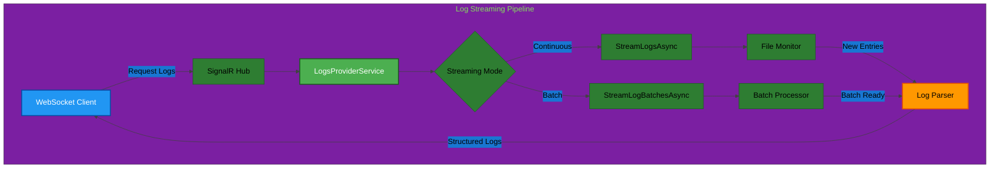

# WebSocket Communication Architecture

## Overview

Jiro implements a hybrid communication architecture that combines WebSocket connections for real-time bidirectional communication and gRPC for reliable service interactions. This design provides real-time command reception, live log streaming, and session management through SignalR WebSockets while ensuring reliable command result delivery via gRPC with retry mechanisms.

### Key Features (v1.0.0-beta)
- **Real-time log streaming** via `StreamLogsAsync` and `StreamLogBatchesAsync`
- **Enhanced session management** with client-side session ID generation
- **Improved WebSocket contracts** using `IJiroInstance` interface
- **Bidirectional streaming** for logs, sessions, and configuration updates

## Architecture Components

### Core Services

- **`JiroWebSocketService`**: Main orchestration service managing the entire communication lifecycle
- **`WebSocketConnection`**: Enhanced WebSocket implementation using SignalR for real-time bidirectional communication
- **`JiroGrpcService`**: gRPC client service for sending command results back to the server
- **`ICommandQueueMonitor`**: Interface for monitoring command execution metrics
- **`LogsProviderService`**: Real-time log streaming with continuous monitoring
- **`SessionManager`**: Enhanced session lifecycle management with caching
- **`MessageCacheService`**: Optimized message operations and caching

## Communication Flow



## Service Architecture



## Dependency Injection and Scoping



## Message Flow and Data Structures

### Command Message Structure

```json
{
  "instanceId": "user-123",
  "command": "chat Hello Jiro",
  "commandSyncId": "cmd-456-789",
  "sessionId": "session-abc",  // Now generated client-side
  "parameters": {
    "key1": "value1",
    "key2": "value2"
  }
}
```

### Command Response Structure (gRPC)

```protobuf
message ClientMessage {
    string commandName = 1;
    CommandType commandType = 2;
    oneof result {
        TextResult textResult = 3;
        GraphResult graphResult = 4;
    }
    bool isSuccess = 5;
    string commandSyncId = 6;
}
```

## Connection Management



## Error Handling and Retry Logic

### WebSocket Connection Retry



### gRPC Result Sending Retry



## Configuration

### WebSocket Configuration

```json
{
  "WebSocket": {
    "HubUrl": "https://localhost:5001/instanceHub",
    "ReconnectionDelayMs": 5000,
    "MaxReconnectionAttempts": 5,
    "HandshakeTimeoutMs": 15000,
    "KeepAliveIntervalMs": 15000,
    "ServerTimeoutMs": 30000,
    "AccessToken": null,
    "Headers": {
      "User-Agent": "Jiro-Bot/1.0"
    }
  }
}
```

### gRPC Configuration

```json
{
  "Grpc": {
    "ServerUrl": "https://localhost:5001",
    "TimeoutMs": 30000,
    "MaxRetries": 3
  }
}
```

## Service Registration

The communication services are registered in the DI container as follows:

```csharp
// Configure options
services.Configure<WebSocketOptions>(configuration.GetSection("WebSocket"));
services.Configure<GrpcOptions>(configuration.GetSection("Grpc"));

// Register scoped gRPC service (per command execution)
services.AddScoped<IJiroGrpcService, JiroGrpcService>();

// Register singleton WebSocket connection
services.AddSingleton<IWebSocketConnection, SignalRWebSocketConnection>();

// Register main orchestration service as hosted service
services.AddHostedService<JiroWebSocketService>();

// Register command queue monitoring interface
services.AddSingleton<ICommandQueueMonitor, JiroWebSocketService>();
```

## Command Execution Lifecycle



## Command Queue Monitoring

The `ICommandQueueMonitor` interface provides real-time insights into command execution:

### Monitoring Metrics

- **Active Command Count**: Number of currently executing commands
- **Active Command IDs**: List of command synchronization IDs being processed
- **Total Commands Processed**: Lifetime count of processed commands
- **Successful Commands**: Count of successfully completed commands
- **Failed Commands**: Count of commands that resulted in errors

### Usage Example

```csharp
public class MonitoringController : ControllerBase
{
    private readonly ICommandQueueMonitor _monitor;
    
    [HttpGet("status")]
    public IActionResult GetStatus()
    {
        return Ok(new
        {
            ActiveCommands = _monitor.ActiveCommandCount,
            TotalProcessed = _monitor.TotalCommandsProcessed,
            SuccessRate = _monitor.SuccessfulCommands / (double)_monitor.TotalCommandsProcessed
        });
    }
}
```

## Key Benefits

### Architecture Advantages

1. **Real-time Communication**: WebSocket provides instant command delivery
2. **Reliable Result Delivery**: gRPC ensures command results reach the server
3. **Automatic Reconnection**: Built-in reconnection logic for WebSocket connections
4. **Retry Mechanisms**: Exponential backoff for both WebSocket and gRPC operations
5. **Proper Resource Management**: Scoped services ensure proper cleanup per command
6. **Monitoring and Observability**: Built-in command queue monitoring
7. **Error Resilience**: Comprehensive error handling at all levels

### Performance Characteristics

- **Low Latency**: Direct WebSocket connection for command reception
- **High Reliability**: gRPC with retry logic for result delivery
- **Resource Efficient**: Scoped dependency injection prevents resource leaks
- **Concurrent Processing**: Multiple commands can be processed simultaneously
- **Graceful Degradation**: System continues operating during temporary network issues

## Real-Time Log Streaming (v1.0.0-beta)

### Log Streaming Architecture

The enhanced logging system provides real-time log streaming capabilities through WebSocket connections:



### Streaming Methods

#### Continuous Log Streaming
```csharp
public async IAsyncEnumerable<LogEntry> StreamLogsAsync(
    string? level = null, 
    int initialLimit = 50,
    [EnumeratorCancellation] CancellationToken cancellationToken = default)
{
    // Returns existing logs first
    // Then continuously monitors for new entries
    // Real-time delivery as logs are written
}
```

#### Batch Log Streaming
```csharp
public async IAsyncEnumerable<IEnumerable<LogEntry>> StreamLogBatchesAsync(
    string? level = null, 
    int initialLimit = 50, 
    int batchSize = 10,
    [EnumeratorCancellation] CancellationToken cancellationToken = default)
{
    // Delivers logs in configurable batches
    // Optimized for high-volume scenarios
    // Reduces network overhead
}
```

### Enhanced Log Parsing

The log parser now supports:
- **Timezone-aware timestamps**: Handles logs with timezone offsets (e.g., `+00:00`)
- **Multi-line log entries**: Correctly groups stack traces and multi-line messages
- **Regex pattern matching**: Intelligent parsing of various log formats
- **Level filtering**: Real-time filtering by log level (INFO, WARN, ERROR, etc.)

### WebSocket Events for Logging

```csharp
// Request continuous log stream
connection.On<GetLogsRequest>("LogsStreamRequested", async (request) =>
{
    await foreach (var log in logsProvider.StreamLogsAsync(request.Level))
    {
        await connection.SendAsync("LogEntry", log);
    }
});

// Request batch log stream
connection.On<GetLogsRequest>("LogBatchesRequested", async (request) =>
{
    await foreach (var batch in logsProvider.StreamLogBatchesAsync(
        request.Level, 
        request.InitialLimit, 
        request.BatchSize))
    {
        await connection.SendAsync("LogBatch", batch);
    }
});
```

## Integration Points

### Server-Side Integration

The server must implement:

- SignalR Hub with `ReceiveCommand` method
- gRPC service implementing `JiroHubProto` service
- Proper authentication and authorization mechanisms

### Client Command Processing

Commands flow through the following pipeline:

1. WebSocket reception via SignalR
2. JSON deserialization to `CommandMessage`
3. Service scope creation for dependency injection
4. Command context setup with instance and session data
5. Command execution via `ICommandHandlerService`
6. Result serialization and gRPC transmission
7. Resource cleanup and metrics updating

This architecture provides a robust, scalable, and maintainable communication layer for the Jiro application.
