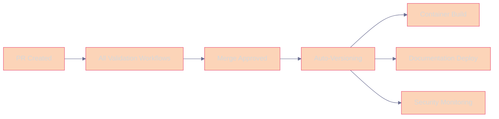
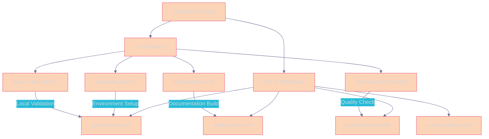

# 🔄 Jiro Workflow Pipelines Documentation

This document describes all the automated workflows and CI/CD pipelines configured for the Jiro project. Each workflow serves a specific purpose in maintaining code quality, security, and deployment automation.

## 📋 Overview

The Jiro project utilizes multiple GitHub Actions workflows organized by responsibility to ensure code quality, security, and automated releases. The workflows are designed to work together to provide comprehensive coverage of the development lifecycle from PR creation to production deployment.

## 🚀 Pipeline Flow: PR → Merge → Deploy

### **Phase 1: Pull Request Validation**

When a Pull Request is created, multiple validation workflows run in parallel:

```mermaid
%%{init: {
  "theme": "base",
  "themeVariables": {
    "background": "#1C1E26",
    "primaryColor": "#FCD4B8",
    "primaryTextColor": "#D5D8DA",
    "primaryBorderColor": "#E95378",
    "lineColor": "#6C6F93",
    "sectionBkgColor": "#232530",
    "altSectionBkgColor": "#2E303E", 
    "gridColor": "#16161C",
    "secondaryColor": "#26BBD9",
    "tertiaryColor": "#27D797",
    "cScale0": "#1C1E26",
    "cScale1": "#232530",
    "cScale2": "#2E303E",
    "cScale3": "#6C6F93",
    "cScale4": "#D5D8DA",
    "clusterBkg": "#232530",
    "clusterBorder": "#6C6F93"
  }
}}%%
graph TD
    A[PR Created/Updated] --> B[.NET CI]
    A --> C[Docker Build]
    A --> D[Markdown Lint]
    A --> E[Security Scan]
    A --> F[Release Validation]
    
    B --> B1[✅ Build & Test & Quality Gate]
    C --> C1[✅ Container Build & Security]
    D --> D1[✅ Documentation Quality]
    E --> E1[✅ CodeQL & Security Audit]
    F --> F1[✅ Additional Validation]
```



### **Phase 2: Post-Merge Automation**

When PR is merged to main, production workflows execute:

```mermaid
%%{init: {
  "theme": "base",
  "themeVariables": {
    "background": "#1C1E26",
    "primaryColor": "#FCD4B8",
    "primaryTextColor": "#D5D8DA",
    "primaryBorderColor": "#E95378",
    "lineColor": "#6C6F93",
    "sectionBkgColor": "#232530",
    "altSectionBkgColor": "#2E303E", 
    "gridColor": "#16161C",
    "secondaryColor": "#26BBD9",
    "tertiaryColor": "#27D797",
    "cScale0": "#1C1E26",
    "cScale1": "#232530",
    "cScale2": "#2E303E",
    "cScale3": "#6C6F93",
    "cScale4": "#D5D8DA",
    "clusterBkg": "#232530",
    "clusterBorder": "#6C6F93"
  }
}}%%
graph TD
    A[Merge to Main] --> B[☁️ Auto-Versioning]
    A --> C[🐳 Docker Push]
    A --> D[📚 Documentation Deploy]
    A --> E[🔒 Security Monitoring]
    
    B --> B1[Version Bump + GitHub Release]
    C --> C1[Container Registry Push]
    D --> D1[GitHub Pages Update]
    E --> E1[Continuous Security Scanning]
```



---

## 🏗️ Workflow Catalog

### **🔧 Core .NET CI** (`jiro-kernel-ci.yml`)

**Triggers:**

- Push to `main` branch (`src/**` changes)
- Pull requests to `main`/`dev` (`src/**` changes)

**Purpose:** Core .NET build, test, and code quality validation

#### **Jobs:**

##### 1. **Build, Test & Format Check** (`build-and-test`)

- **Environment:** Ubuntu Latest
- **.NET Version:** 9.0.x
- **Steps:**
  - Checkout source code with GitHub token
  - Setup .NET 9.0 SDK
  - Prepare configuration files (`Configuration/appsettings.json`)
  - Cache NuGet packages for performance
  - Restore dependencies
  - Build solution (Release configuration)
  - Verify code formatting with `dotnet format`
  - Run unit tests with code coverage
  - Upload test results and coverage to Codecov

##### 2. **.NET Quality Gate** (`quality-gate`)

- **Purpose:** Validate all .NET CI results
- **Dependencies:** `build-and-test`
- **Behavior:**
  - ✅ **SUCCESS**: All build, test, format checks pass
  - ❌ **FAILURE**: Any .NET CI component fails
  - Provides detailed status reporting

---

### **🚀 Auto-Versioning & Release** (`create-release.yml`)

**Triggers:**

- Push to `main` branch
- Pull requests to `main`

**Purpose:** Automated versioning, tagging, and GitHub release creation

#### **Jobs:**

##### 1. **Test and Validate** (PR Only)

- **Condition:** `github.event_name == 'pull_request'`
- **Steps:**
  - .NET build and test validation
  - Code formatting checks
  - Security scanning with CodeQL

##### 2. **Pull Request Validation** (PRs Only)

- **Condition:** `github.event_name == 'pull_request'`
- **Permissions:** `contents: read`
- **Steps:**
  - .NET build and test validation
  - Code formatting checks
  - Security scanning with CodeQL

##### 3. **Release Artifact Build** (Manual Tag Triggered)

- **Condition:** `startsWith(github.ref, 'refs/tags/v')`
- **Permissions:** `contents: write`
- **Steps:**
  - Build release configuration
  - Publish multi-platform binaries (Linux, Windows, macOS)
  - Create release archives
  - Generate release notes with changelog
  - Create GitHub release with artifacts attached

**Manual Release Process:**

1. **Developer manually creates git tag**: `git tag -a v1.2.3 -m "Release v1.2.3"`
2. **Push tag to trigger build**: `git push origin v1.2.3`
3. **Workflow builds multi-platform binaries** automatically
4. **GitHub release created** with all artifacts attached
5. **Full control over release timing** and version numbers

**Release Artifacts Generated:**

- `jiro-kernel-vX.X.X-linux-x64.tar.gz` - Linux 64-bit self-contained binary
- `jiro-kernel-vX.X.X-win-x64.zip` - Windows 64-bit self-contained binary  
- `jiro-kernel-vX.X.X-osx-x64.tar.gz` - macOS 64-bit self-contained binary

---

### **🐳 Container Build & Security** (`docker-build.yml`)

**Triggers:**

- Push to `main` (`src/**`, `Dockerfile` changes)
- Pull requests (`src/**`, `Dockerfile` changes)

**Purpose:** Docker image building, testing, and security scanning

#### **Jobs:**

##### 1. **Docker Build & Verification** (`docker-build`)

- **Environment:** Ubuntu Latest
- **Registry:** GitHub Container Registry (`ghcr.io`)
- **Steps:**
  - Setup Docker Buildx
  - Login to GHCR (main branch only)
  - Extract metadata and tags
  - Build Docker image with caching
  - Test container startup and health
  - Run Trivy vulnerability scanner
  - Upload security scan results
  - Push to registry (main branch only)

**Image Tags Generated:**

- `ghcr.io/huebyte/jiro-kernel:latest` (main branch)
- `ghcr.io/huebyte/jiro-kernel:main` (main branch)
- `ghcr.io/huebyte/jiro-kernel:pr-123` (pull requests)
- `ghcr.io/huebyte/jiro-kernel:sha-abcd123` (commit SHA)

---

### **🔒 Security Scanning** (`jiro-kernel-security.yml`)

**Triggers:**

- Weekly schedule (Mondays at 2 AM UTC)
- Manual workflow dispatch
- Push/PR to main (`src/**` changes)

**Purpose:** Comprehensive security vulnerability detection

#### **Jobs:**

##### 1. **Security Vulnerability Scan**

- **Environment:** Ubuntu Latest
- **Permissions:** `security-events: write`
- **Steps:**
  - .NET security audit (`dotnet list package --vulnerable`)
  - Snyk security scanning (if token configured)
  - CodeQL analysis with security-extended queries
  - Upload security findings to GitHub Security tab

---

### **📝 Documentation Quality** (`markdown-lint.yml`)

**Triggers:**

- Push to `main` (`**/*.md` changes)
- Pull requests (`**/*.md` changes)

**Purpose:** Documentation linting and quality assurance

#### **Jobs:**

##### 1. **Markdown Linting**

- **Environment:** Ubuntu Latest
- **Node.js Version:** 18
- **Steps:**
  - Setup Node.js and markdownlint-cli
  - Create default config if missing
  - Run markdown linting on all `.md` files
  - Ignore build directories and node_modules

---

### **📚 Documentation Deployment** (`deploy-docs.yml`)

**Triggers:**

- Push to `main` (docs/API changes)
- Manual workflow dispatch

**Purpose:** Build and deploy project documentation to GitHub Pages

#### **Jobs:**

##### 1. **Publish Documentation**

- **Environment:** Ubuntu Latest
- **Target:** GitHub Pages
- **Steps:**
  - Setup .NET and DocFX
  - Restore dependencies for API docs
  - Build DocFX documentation
  - Deploy to GitHub Pages

---

## 🎯 Deployment Ready Artifacts

After successful pipeline execution, the following artifacts are available:

### **🐳 Container Images**

```bash
# Latest stable release
docker pull ghcr.io/huebyte/jiro-kernel:latest

# Specific version
docker pull ghcr.io/huebyte/jiro-kernel:v0.1.3

# Development builds
docker pull ghcr.io/huebyte/jiro-kernel:main
```

### **📦 GitHub Releases**

- Semantic versioning with auto-incremented patch versions
- Comprehensive release notes with commit changelog
- Version metadata and build information
- Direct download links for assets

### **📚 Live Documentation**

- **GitHub Pages**: Automatically updated API documentation
- **API Reference**: Generated from XML comments
- **User Guides**: Markdown-based documentation

---

## ⚡ Performance Optimizations

### **Intelligent Triggers**

- **Path-based filtering**: Workflows only run when relevant files change
- **Parallel execution**: Independent workflows run concurrently
- **Conditional jobs**: Jobs run only when necessary (PR vs. main branch)

### **Caching Strategies**

- **NuGet packages**: Cached across builds for faster dependency restoration
- **Docker layers**: GitHub Actions cache for container builds
- **Build artifacts**: Test results and coverage cached between jobs

### **Resource Efficiency**

- **Targeted scans**: Security scans run on schedule vs. every commit
- **Optimized Docker builds**: Multi-stage builds with layer caching
- **Smart dependencies**: Jobs run only after required dependencies complete

---

## 🛡️ Security & Compliance

### **Comprehensive Security Coverage**

- **Static Analysis**: CodeQL for source code security
- **Dependency Scanning**: Snyk and .NET audit for vulnerable packages
- **Container Security**: Trivy scanner for Docker image vulnerabilities
- **Access Control**: Proper GitHub token permissions and secrets management

### **Quality Gates**

- **Automated Formatting**: Enforced code style with `dotnet format`
- **Test Coverage**: Comprehensive unit test execution with coverage reporting
- **Documentation Quality**: Markdown linting for documentation consistency
- **Build Verification**: Multi-stage validation before release

---

## 🔧 Configuration Management

### **Configuration File Structure**

Jiro uses an organized configuration structure with all settings centralized in the `Configuration` directory:

```
src/Jiro.Kernel/Jiro.App/Configuration/
├── appsettings.json          # Main configuration (created from example)
├── appsettings.example.json  # Configuration template
├── appsettings.dev.json      # Development-specific overrides
└── appsettings.backup.json   # Backup configuration
```

**Configuration File Hierarchy:**
1. `appsettings.json` - Base configuration
2. `appsettings.{environment}.json` - Environment-specific overrides
3. Environment variables with `JIRO_` prefix - Runtime overrides

**Workflow Integration:**
- CI/CD pipelines automatically copy `appsettings.example.json` to `appsettings.json`
- The example file contains safe defaults for build and test environments
- Production deployments use environment variables for sensitive values

### **Environment Variables**

- `DOTNET_VERSION: "9.0.x"` - Consistent .NET version across all workflows
- `SOLUTION_PATH: "./src/Main.sln"` - Central solution file reference
- `REGISTRY: ghcr.io` - Container registry configuration

### **Secrets Required**

- `GITHUB_TOKEN` - Automatically provided, used for repository access
- `SNYK_TOKEN` - Optional, for enhanced security scanning
- `CODECOV_TOKEN` - Optional, for code coverage reporting

### **Workflow Dependencies**



---

## 📈 Monitoring & Observability

### **Workflow Status**

- **Quality Gates**: Clear pass/fail indicators for each pipeline stage
- **Artifact Tracking**: Test results, coverage reports, and build outputs
- **Security Alerts**: Automated vulnerability detection and reporting

### **Performance Metrics**

- **Build Times**: Optimized with caching and parallel execution
- **Test Coverage**: Tracked and reported via Codecov
- **Security Posture**: Regular scanning with trend analysis

This comprehensive pipeline ensures high code quality, security, and reliable deployment automation for the Jiro project.

- Setup Node.js environment
- Install markdownlint-cli globally
- Run markdownlint on all markdown files
- Create default configuration if not present

**Key Features:**

- **Comprehensive Coverage:** Lints all `*.md` files in the repository
- **Smart Exclusions:** Ignores `node_modules`, `TestResults`, and `src/docs/build` directories
- **Configurable Rules:** Uses `.markdownlint.json` for custom rule configuration
- **Non-blocking:** Warnings are reported but don't fail the pipeline
- **Auto-configuration:** Creates sensible defaults if no config exists

**Default Rules:**

- MD013 (line length): Disabled for flexibility
- MD033 (inline HTML): Allowed for enhanced formatting
- MD041 (first line heading): Not enforced
- MD024 (duplicate headings): Allowed for structured documents
- MD029 (ordered list prefixes): Flexible numbering allowed

#### 3. **Security Vulnerability Scanning** (`security-scan`)

- **Dependencies:** Requires `build-and-test` to complete successfully
- **Steps:**
  - Run .NET security audit for vulnerable packages
  - Install and run Snyk CLI security scanning (if token is configured)
  - Initialize and run CodeQL static analysis
  - Perform comprehensive security analysis

**Security Tools:**

- **.NET Security Audit:** Scans for vulnerable NuGet packages
- **Snyk:** Third-party vulnerability scanning (optional)
- **CodeQL:** GitHub's semantic code analysis engine

##### 4. **Docker Build and Verification** (`docker-build`)

- **Dependencies:** Requires `build-and-test` to complete successfully
- **Steps:**
  - Setup Docker Buildx for advanced Docker features
  - Login to GitHub Container Registry (for non-PR events)
  - Extract Docker metadata and generate tags
  - Build Docker image with caching
  - Test Docker container functionality
  - Run Trivy vulnerability scanner on the built image
  - Push Docker image to registry (for non-PR events)

**Docker Features:**

- **Multi-platform Support:** Uses Docker Buildx
- **Intelligent Tagging:** Branch-based, PR-based, and SHA-based tags
- **Build Caching:** GitHub Actions cache for faster builds
- **Container Testing:** Automated health checks
- **Security Scanning:** Trivy vulnerability assessment
- **Registry Integration:** Automatic push to GitHub Container Registry

##### 5. **Quality Gate** (`quality-gate`)

- **Dependencies:** Waits for all previous jobs to complete
- **Purpose:** Final validation and reporting
- **Logic:**
  - Fails if build-and-test fails
  - Warns but doesn't fail for markdown linting failures
  - Warns but doesn't fail for security scan failures
  - Fails if Docker build fails
  - Provides comprehensive status summary

## 🚀 Release Automation

### **Create Release on Main Branch** (`create-release.yml`)

**Triggers:**

- Direct push to `main` branch
- Pull request from `dev` to `main` branch (when merged)

**Purpose:** Automated release creation when code is pushed or merged to the main branch.

#### **Process:**

1. **Version Detection:**
   - Extracts version from `Jiro.App.csproj`
   - Falls back to date-based versioning if no version found
   - Prefixes version with 'v' (e.g., `v1.0.0`)

2. **Tag Management:**
   - Checks if the version tag already exists
   - Skips release creation if tag exists
   - Creates new Git tag if version is new

3. **Release Notes Generation:**
   - Automatically generates commit history since last release
   - Includes merged commits from dev to main
   - Adds link to full changelog

4. **GitHub Release Creation:**
   - Creates GitHub release with generated notes
   - Links to the appropriate Git tag
   - Provides downloadable assets

**Features:**

- **Intelligent Version Detection:** Multiple fallback strategies
- **Duplicate Prevention:** Prevents duplicate releases
- **Automated Documentation:** Generated release notes
- **Branch-aware:** Handles both direct pushes and PR merges

### **Auto Release on Main Push** (`auto-release.yml`)

**Triggers:**

- Push to `main` branch

**Purpose:** Alternative release automation focused on immediate releases upon main branch updates.

#### **Key Differences from `create-release.yml`:**

- Simplified version detection logic
- Searches multiple project files for version information
- More aggressive in creating releases
- Focuses on Main.sln structure compatibility

## 📚 Documentation Deployment

### **Deploy Documentation to GitHub Pages** (`deploy-docs.yml`)

**Triggers:**

- Push to `main` branch (when changes are made to documentation files)
- Paths monitored:
  - `docs/**` - Documentation content
  - `assets/**` - Images and assets
  - `docfx.json` - DocFX configuration
  - `index.md` - Main homepage
  - `toc.yml` - Table of contents
  - `src/**/*.cs` - Source code for API documentation
- Manual trigger via workflow_dispatch

**Purpose:** Automatically builds and deploys the DocFX documentation site to GitHub Pages whenever documentation changes are pushed to the main branch.

#### **Build Process:**

1. **Environment Setup**
   - Ubuntu Latest runner
   - .NET 9.x SDK installation
   - DocFX tool installation (version 2.75.3)

2. **Project Preparation**
   - Restore NuGet dependencies for API documentation
   - Build .NET projects to generate XML documentation files
   - Continue on build errors (API docs still generate)

3. **Documentation Generation**
   - Run `docfx docfx.json` to build complete documentation
   - Generate both documentation and API reference
   - Create static website in `_site/` directory

4. **Deployment to GitHub Pages**
   - Upload generated site as Pages artifact
   - Deploy to GitHub Pages using official actions
   - Provide deployment URL feedback

#### **Generated Content:**

- **Documentation Pages** (`/docs/`): Project guides, architecture, user documentation
- **API Reference** (`/api/`): Auto-generated .NET API documentation from XML comments
- **Assets**: Images, logos, and styling assets
- **Navigation**: Organized table of contents and cross-references

#### **Features:**

- **Automatic API Documentation:** Generated from XML comments in source code
- **Asset Management:** Proper handling of images and logos (including custom Jiro branding)
- **Clean URLs:** Organized structure with `/docs/` and `/api/` sections
- **Modern Theme:** DocFX modern template with custom branding
- **Error Resilience:** Continues deployment even if some .NET projects fail to build

## 🔒 Security Workflows

### **Jiro Security Scan** (`jiro-kernel-security.yml`)

**Triggers:**

- **Scheduled:** Every Monday at 2 AM UTC
- **Manual:** Via workflow dispatch

**Purpose:** Weekly comprehensive security audit of the codebase and dependencies.

#### **Security Checks:**

1. **Package Vulnerability Scanning:**
   - Scans all NuGet packages for known vulnerabilities
   - Includes transitive dependencies
   - Generates detailed vulnerability reports

2. **Dependency Analysis:**
   - Analyzes all project dependencies
   - Reports security advisories
   - Provides remediation suggestions

3. **Regular Monitoring:**
   - Weekly automated execution
   - Manual trigger capability for immediate scans
   - GitHub Security tab integration

### **CodeQL Integration** (within main CI)

**Continuous Security Analysis:**

- Static code analysis during every build
- Semantic code understanding
- Security vulnerability detection
- Integration with GitHub Security Advisory Database

## ⚡ Performance Monitoring

### **Jiro Performance Test** (`jiro-kernel-performance.yml`)

**Triggers:**

- **Scheduled:** Every Sunday at 3 AM UTC
- **Manual:** Via workflow dispatch with optional benchmark filters

**Purpose:** Regular performance monitoring and benchmarking of the Jiro application.

#### **Performance Testing:**

1. **Benchmark Execution:**
   - Runs performance tests in Release configuration
   - Supports filtered benchmark execution
   - Measures execution time and resource usage

2. **Performance Regression Detection:**
   - Compares results against previous runs
   - Identifies performance degradations
   - Provides detailed performance reports

3. **Resource Monitoring:**
   - Memory usage analysis
   - CPU utilization tracking
   - Response time measurements

## 🛠️ Development and Debugging

### **Simple Push Test** (`simple-test.yml`)

**Triggers:**

- Push to `main` branch (excluding `src/**` changes to avoid overlap)

**Purpose:** Lightweight workflow for testing basic GitHub Actions functionality.

#### **Functionality:**

- Verifies workflow trigger mechanisms
- Lists repository contents
- Searches for version information in project files
- Provides basic repository health checks

### **Debug Workflow Triggers** (`debug-triggers.yml`)

**Triggers:**

- Push to `main` branch
- Pull requests to `main` or `dev` branches

**Purpose:** Debugging and monitoring workflow trigger events.

#### **Debug Information:**

- **Event Details:** Captures all GitHub event information
- **Branch Information:** Tracks branch changes and merges
- **Pull Request Analysis:** Monitors PR lifecycle events
- **Commit Tracking:** Logs commit SHAs and changes

## 🔄 Local Development Support

### **Local CI Testing Scripts**

The project includes scripts for local testing of CI/CD workflows:

#### **local-ci-test.sh** (Linux/macOS)

- Mimics GitHub Actions workflows locally
- Supports building, testing, and Docker operations
- Provides colored output for better readability
- Validates changes before pushing to remote

### **Development Automation Scripts**

The `scripts/` directory contains a comprehensive set of automation tools for developers and CI/CD workflows:

#### **Setup and Onboarding Scripts**

##### **setup-dev.ps1 / setup-dev.sh**

- **Purpose**: Automated development environment setup for new contributors
- **Features**: Tool validation, dependency installation, configuration file setup
- **Usage**: First-time developer onboarding and environment validation
- **Integration**: Used by CI/CD for environment preparation

#### **Documentation Scripts**

##### **docfx-gen.ps1 / docfx-gen.sh**

- **Purpose**: Generate API documentation using DocFX
- **Features**: Build and serve documentation locally
- **Integration**: Used by `deploy-docs.yml` workflow for documentation deployment

##### **markdown-lint.ps1 / markdown-lint.sh**

- **Purpose**: Ensure markdown quality and consistency
- **Features**: Lint checking with auto-fix capabilities
- **Integration**: Used by `markdown-lint.yml` workflow for documentation quality

##### **generate-project-structure.ps1 / generate-project-structure.sh**

- **Purpose**: Generate project structure documentation
- **Features**: Tree view generation with smart filtering
- **Integration**: Keeps project documentation up-to-date automatically

#### **Testing and Validation Scripts**

##### **local-ci-test.ps1 / local-ci-test.sh**

- **Purpose**: Run complete CI/CD pipeline locally
- **Features**: Build, test, documentation, and linting validation
- **Benefits**: Pre-push validation to catch issues early
- **Parallel to**: All GitHub Actions workflows

#### **Release Management Scripts**

##### **create-release.ps1 / create-release.sh**

- **Purpose**: Automated release process
- **Features**: Version management, tagging, and artifact preparation
- **Integration**: Supports the `create-release.yml` workflow

#### **Cross-Platform Compatibility**

All scripts are available in both PowerShell (`.ps1`) and Bash (`.sh`) versions:

- **Windows**: PowerShell scripts with Windows PowerShell or PowerShell Core
- **Linux/macOS**: Bash scripts or PowerShell Core
- **CI/CD**: Platform-appropriate scripts selected automatically
- **Developer Choice**: Use preferred shell environment

#### **Script Integration with Workflows**



For detailed information about all available scripts, see [Scripts Reference](scripts-reference.md).

## 🔄 Workflow Integration Matrix

The following table shows how development scripts integrate with GitHub Actions workflows:

| Script/Workflow                  | `jiro-kernel-ci.yml` | `create-release.yml` | `docker-build.yml` | `jiro-kernel-security.yml` | `markdown-lint.yml` | `deploy-docs.yml` |
|----------------------------------|----------------------|----------------------|--------------------|---------------------------|---------------------|-------------------|
| `setup-dev.ps1` / `setup-dev.sh`| No                   | No                   | No                 | No                        | No                  | No                |
| `docfx-gen.ps1` / `docfx-gen.sh`| No                   | No                   | No                 | No                        | No                  | Yes                |
| `markdown-lint.ps1` / `markdown-lint.sh`| No                   | No                   | No                 | No                        | Yes                 | No                |
| `generate-project-structure.ps1` / `generate-project-structure.sh`| No                   | No                   | No                 | No                        | No                  | No                |
| `local-ci-test.ps1` / `local-ci-test.sh`| Yes                  | No                   | Yes                | Yes                       | Yes                 | Yes                |
| `create-release.ps1` / `create-release.sh`| No                   | Yes                  | No                 | No                        | No                  | No                |

This table summarizes the integration of development automation scripts with the various CI/CD workflows in the Jiro project. Scripts like `local-ci-test` are integral to multiple workflows for local testing, security scanning, and documentation generation. Other scripts, such as `create-release`, are specifically tied to release automation workflows. This modular approach allows for flexible and comprehensive automation coverage across the development lifecycle.

| Script | GitHub Workflow | Purpose | Integration Type |
|--------|----------------|---------|-----------------|
| `setup-dev.ps1/.sh` | Environment Setup | Developer onboarding | Manual/CI preparation |
| `local-ci-test.ps1/.sh` | All workflows | Local validation | Developer testing |
| `docfx-gen.ps1/.sh` | `deploy-docs.yml` | Documentation build | Automated deployment |
| `markdown-lint.ps1/.sh` | `markdown-lint.yml` | Quality assurance | Automated validation |
| `generate-project-structure.ps1/.sh` | Manual/Scheduled | Documentation update | Manual/Automated |
| `create-release.ps1/.sh` | `create-release.yml` | Release management | Manual/Triggered |
