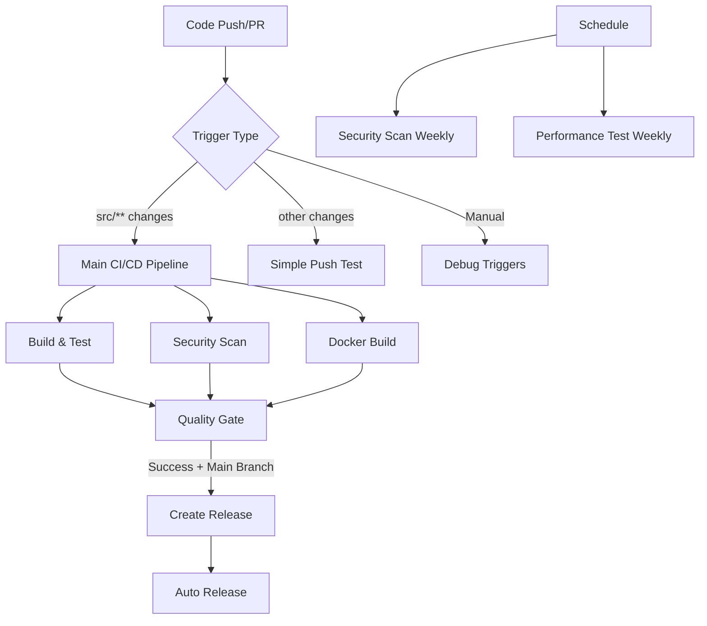

# 🔄 Jiro Workflow Pipelines Documentation

This document describes all the automated workflows and CI/CD pipelines configured for the Jiro project. Each workflow serves a specific purpose in maintaining code quality, security, and deployment automation.

## 📋 Overview

The Jiro project utilizes multiple GitHub Actions workflows to ensure code quality, security, and automated releases. The workflows are designed to work together to provide comprehensive coverage of the development lifecycle.

## 🏗️ Main CI/CD Pipeline

### **Jiro CI/CD** (`jiro-kernel-ci.yml`)

**Triggers:**

- Push to `main` branch (when changes are made to `src/**` or the workflow file)
- Pull requests to `main` or `dev` branches (when changes are made to `src/**` or the workflow file)

**Purpose:** Primary continuous integration and deployment pipeline that builds, tests, and validates the Jiro application.

#### **Jobs:**

##### 1. **Build and Test** (`build-and-test`)

- **Environment:** Ubuntu Latest
- **.NET Version:** 9.0.x
- **Steps:**
  - Checkout source code
  - Setup .NET SDK
  - Prepare configuration files (copy `appsettings.example.json` to `appsettings.json`)
  - Cache NuGet packages for faster builds
  - Restore project dependencies
  - Build solution in Release configuration
  - Check code formatting compliance using `dotnet format`
  - Run all unit tests with code coverage
  - Upload test results as artifacts
  - Upload code coverage to Codecov

**Key Features:**

- Automated configuration file preparation
- NuGet package caching for performance
- Code formatting verification
- Comprehensive test execution with coverage reporting

##### 2. **Markdown Linting** (`markdown-lint`)

- **Environment:** Ubuntu Latest
- **Node.js Version:** 18
- **Steps:**
  - Checkout source code
  - Setup Node.js environment
  - Install markdownlint-cli globally
  - Run markdownlint on all markdown files
  - Create default configuration if not present

**Key Features:**

- **Comprehensive Coverage:** Lints all `*.md` files in the repository
- **Smart Exclusions:** Ignores `node_modules`, `TestResults`, and `src/docs/build` directories
- **Configurable Rules:** Uses `.markdownlint.json` for custom rule configuration
- **Non-blocking:** Warnings are reported but don't fail the pipeline
- **Auto-configuration:** Creates sensible defaults if no config exists

**Default Rules:**

- MD013 (line length): Disabled for flexibility
- MD033 (inline HTML): Allowed for enhanced formatting
- MD041 (first line heading): Not enforced
- MD024 (duplicate headings): Allowed for structured documents
- MD029 (ordered list prefixes): Flexible numbering allowed

##### 3. **Security Vulnerability Scanning** (`security-scan`)

- **Dependencies:** Requires `build-and-test` to complete successfully
- **Steps:**
  - Run .NET security audit for vulnerable packages
  - Install and run Snyk CLI security scanning (if token is configured)
  - Initialize and run CodeQL static analysis
  - Perform comprehensive security analysis

**Security Tools:**

- **.NET Security Audit:** Scans for vulnerable NuGet packages
- **Snyk:** Third-party vulnerability scanning (optional)
- **CodeQL:** GitHub's semantic code analysis engine

##### 4. **Docker Build and Verification** (`docker-build`)

- **Dependencies:** Requires `build-and-test` to complete successfully
- **Steps:**
  - Setup Docker Buildx for advanced Docker features
  - Login to GitHub Container Registry (for non-PR events)
  - Extract Docker metadata and generate tags
  - Build Docker image with caching
  - Test Docker container functionality
  - Run Trivy vulnerability scanner on the built image
  - Push Docker image to registry (for non-PR events)

**Docker Features:**

- **Multi-platform Support:** Uses Docker Buildx
- **Intelligent Tagging:** Branch-based, PR-based, and SHA-based tags
- **Build Caching:** GitHub Actions cache for faster builds
- **Container Testing:** Automated health checks
- **Security Scanning:** Trivy vulnerability assessment
- **Registry Integration:** Automatic push to GitHub Container Registry

##### 5. **Quality Gate** (`quality-gate`)

- **Dependencies:** Waits for all previous jobs to complete
- **Purpose:** Final validation and reporting
- **Logic:**
  - Fails if build-and-test fails
  - Warns but doesn't fail for markdown linting failures
  - Warns but doesn't fail for security scan failures
  - Fails if Docker build fails
  - Provides comprehensive status summary

## 🚀 Release Automation

### **Create Release on Main Branch** (`create-release.yml`)

**Triggers:**

- Direct push to `main` branch
- Pull request from `dev` to `main` branch (when merged)

**Purpose:** Automated release creation when code is pushed or merged to the main branch.

#### **Process:**

1. **Version Detection:**
   - Extracts version from `Jiro.App.csproj`
   - Falls back to date-based versioning if no version found
   - Prefixes version with 'v' (e.g., `v1.0.0`)

2. **Tag Management:**
   - Checks if the version tag already exists
   - Skips release creation if tag exists
   - Creates new Git tag if version is new

3. **Release Notes Generation:**
   - Automatically generates commit history since last release
   - Includes merged commits from dev to main
   - Adds link to full changelog

4. **GitHub Release Creation:**
   - Creates GitHub release with generated notes
   - Links to the appropriate Git tag
   - Provides downloadable assets

**Features:**

- **Intelligent Version Detection:** Multiple fallback strategies
- **Duplicate Prevention:** Prevents duplicate releases
- **Automated Documentation:** Generated release notes
- **Branch-aware:** Handles both direct pushes and PR merges

### **Auto Release on Main Push** (`auto-release.yml`)

**Triggers:**

- Push to `main` branch

**Purpose:** Alternative release automation focused on immediate releases upon main branch updates.

#### **Key Differences from `create-release.yml`:**

- Simplified version detection logic
- Searches multiple project files for version information
- More aggressive in creating releases
- Focuses on Main.sln structure compatibility

## 🔒 Security Workflows

### **Jiro Security Scan** (`jiro-kernel-security.yml`)

**Triggers:**

- **Scheduled:** Every Monday at 2 AM UTC
- **Manual:** Via workflow dispatch

**Purpose:** Weekly comprehensive security audit of the codebase and dependencies.

#### **Security Checks:**

1. **Package Vulnerability Scanning:**
   - Scans all NuGet packages for known vulnerabilities
   - Includes transitive dependencies
   - Generates detailed vulnerability reports

2. **Dependency Analysis:**
   - Analyzes all project dependencies
   - Reports security advisories
   - Provides remediation suggestions

3. **Regular Monitoring:**
   - Weekly automated execution
   - Manual trigger capability for immediate scans
   - GitHub Security tab integration

### **CodeQL Integration** (within main CI)

**Continuous Security Analysis:**

- Static code analysis during every build
- Semantic code understanding
- Security vulnerability detection
- Integration with GitHub Security Advisory Database

## ⚡ Performance Monitoring

### **Jiro Performance Test** (`jiro-kernel-performance.yml`)

**Triggers:**

- **Scheduled:** Every Sunday at 3 AM UTC
- **Manual:** Via workflow dispatch with optional benchmark filters

**Purpose:** Regular performance monitoring and benchmarking of the Jiro application.

#### **Performance Testing:**

1. **Benchmark Execution:**
   - Runs performance tests in Release configuration
   - Supports filtered benchmark execution
   - Measures execution time and resource usage

2. **Performance Regression Detection:**
   - Compares results against previous runs
   - Identifies performance degradations
   - Provides detailed performance reports

3. **Resource Monitoring:**
   - Memory usage analysis
   - CPU utilization tracking
   - Response time measurements

## 🛠️ Development and Debugging

### **Simple Push Test** (`simple-test.yml`)

**Triggers:**

- Push to `main` branch (excluding `src/**` changes to avoid overlap)

**Purpose:** Lightweight workflow for testing basic GitHub Actions functionality.

#### **Functionality:**

- Verifies workflow trigger mechanisms
- Lists repository contents
- Searches for version information in project files
- Provides basic repository health checks

### **Debug Workflow Triggers** (`debug-triggers.yml`)

**Triggers:**

- Push to `main` branch
- Pull requests to `main` or `dev` branches

**Purpose:** Debugging and monitoring workflow trigger events.

#### **Debug Information:**

- **Event Details:** Captures all GitHub event information
- **Branch Information:** Tracks branch changes and merges
- **Pull Request Analysis:** Monitors PR lifecycle events
- **Commit Tracking:** Logs commit SHAs and changes

## 🔄 Local Development Support

### **Local CI Testing Scripts**

The project includes scripts for local testing of CI/CD workflows:

#### **local-ci-test.sh** (Linux/macOS)

- Mimics GitHub Actions workflows locally
- Supports building, testing, and Docker operations
- Provides colored output for better readability
- Validates changes before pushing to remote

#### **local-ci-test.ps1** (Windows PowerShell)

- Windows equivalent of the bash script
- PowerShell-based automation
- Cross-platform .NET testing
- Local Docker validation

#### **create-release.sh** / **create-release.ps1**

- Local release preparation scripts
- Version validation and tagging
- Release notes generation
- Pre-release testing capabilities

## 📊 Workflow Orchestration

### **Execution Flow:**

### **Quality Assurance Pipeline:**

1. **Code Quality:** Format checking, compilation, and testing
2. **Security:** Vulnerability scanning and static analysis
3. **Containerization:** Docker build and security scanning
4. **Integration:** End-to-end validation
5. **Release:** Automated version management and distribution

## 🎯 Best Practices Implemented

### **Performance Optimization:**

- **Caching:** NuGet packages and Docker layers
- **Parallel Execution:** Independent jobs run concurrently
- **Conditional Logic:** Skip unnecessary steps based on context

### **Security First:**

- **Multi-layered Security:** Package, code, and container scanning
- **Regular Audits:** Scheduled security reviews
- **Automated Updates:** Dependency vulnerability monitoring

### **Developer Experience:**

- **Clear Feedback:** Detailed success/failure reporting
- **Fast Feedback:** Parallel job execution
- **Local Testing:** Scripts for pre-commit validation

### **Reliability:**

- **Error Handling:** Graceful failure management
- **Retry Logic:** Resilient against transient failures
- **Monitoring:** Comprehensive logging and reporting

## 🔧 Configuration Management

### **Environment Variables:**

- `DOTNET_VERSION`: .NET SDK version (9.0.x)
- `SOLUTION_PATH`: Path to main solution file
- `DOCKER_IMAGE_NAME`: Docker image naming convention
- `REGISTRY`: Container registry URL (ghcr.io)

### **Secrets Management:**

- `GITHUB_TOKEN`: Automatic GitHub authentication
- `SNYK_TOKEN`: Optional Snyk security scanning
- `CODECOV_TOKEN`: Code coverage reporting

### **Path Filtering:**

- Source code changes trigger full CI/CD
- Documentation changes trigger minimal workflows
- Workflow file changes trigger full validation

## 📈 Monitoring and Observability

### **Metrics Collected:**

- **Build Success Rate:** Track pipeline reliability
- **Test Coverage:** Monitor code quality trends
- **Security Vulnerabilities:** Track security posture
- **Performance Metrics:** Monitor application performance
- **Release Frequency:** Track deployment cadence

### **Reporting:**

- **GitHub Actions Summary:** Detailed step-by-step reporting
- **Codecov Integration:** Code coverage trends
- **Security Tab:** Vulnerability tracking
- **Release Notes:** Automated change documentation

## 🚀 Future Enhancements

### **Planned Improvements:**

- **Multi-environment Deployment:** Staging and production pipelines
- **Integration Testing:** End-to-end test automation
- **Performance Benchmarking:** Historical performance tracking
- **Dependency Updates:** Automated dependency management
- **Container Registry:** Multi-registry support

This comprehensive workflow system ensures that the Jiro project maintains high quality, security, and reliability throughout its development lifecycle while providing developers with fast feedback and automated deployment capabilities.
