# 📊 Jiro Database ERD Diagram

Ten plik zawiera wizualny diagram relacji bazy danych Jiro w formacie Mermaid.

## 🗄️ Entity Relationship Diagram

```mermaid
erDiagram
    %% ASP.NET IDENTITY ENTITIES
    AspNetUsers {
        string Id PK "Primary Key"
        string UserName "Username (256)"
        string NormalizedUserName UK "Normalized username" 
        string Email "Email address (256)"
        string NormalizedEmail "Normalized email"
        boolean EmailConfirmed "Email confirmed flag"
        string PasswordHash "Password hash"
        string SecurityStamp "Security stamp"
        string ConcurrencyStamp "Concurrency token"
        string PhoneNumber "Phone number"
        boolean PhoneNumberConfirmed "Phone confirmed flag"
        boolean TwoFactorEnabled "2FA enabled flag"
        DateTimeOffset LockoutEnd "Lockout end date"
        boolean LockoutEnabled "Lockout enabled flag"
        int AccessFailedCount "Failed login count"
        DateTime AccountCreatedDate "Account creation date"
    }

    AspNetRoles {
        string Id PK "Primary Key"
        string Name "Role name (256)"
        string NormalizedName UK "Normalized role name"
        string ConcurrencyStamp "Concurrency token"
    }

    AspNetUserRoles {
        string UserId PK "User ID"
        string RoleId PK "Role ID"
    }

    AspNetUserClaims {
        int Id PK "Primary Key"
        string UserId FK "User ID"
        string ClaimType "Claim type"
        string ClaimValue "Claim value"
    }

    AspNetRoleClaims {
        int Id PK "Primary Key"
        string RoleId FK "Role ID"
        string ClaimType "Claim type"
        string ClaimValue "Claim value"
    }

    AspNetUserLogins {
        string LoginProvider PK "Login provider"
        string ProviderKey PK "Provider key"
        string ProviderDisplayName "Provider display name"
        string UserId FK "User ID"
    }

    AspNetUserTokens {
        string UserId PK "User ID"
        string LoginProvider PK "Login provider"
        string Name PK "Token name"
        string Value "Token value"
    }

    %% JIRO BUSINESS ENTITIES
    ChatSessions {
        string Id PK "Primary Key"
        string Name "Session name"
        string Description "Session description"
        DateTime CreatedAt "Creation date"
        DateTime LastUpdatedAt "Last update date"
    }

    Messages {
        string Id PK "Primary Key"
        string Content "Message content"
        string InstanceId "User instance ID"
        string SessionId "Session ID (duplicate)"
        string ChatSessionId FK "Chat session FK"
        boolean IsUser "Is user message flag"
        DateTime CreatedAt "Creation date"
        int Type "Message type enum"
    }

    RefreshTokens {
        int Id PK "Primary Key"
        string Token "Refresh token"
        DateTime Expires "Expiration date"
        DateTime Created "Creation date"
        string CreatedByIp "Creator IP address"
        DateTime Revoked "Revocation date"
        string RevokedByIp "Revoker IP address"
        string ReasonRevoked "Revocation reason"
        string AppUserId FK "User ID"
    }

    %% RELATIONSHIPS

    %% Identity System Relationships
    AspNetUsers ||--o{ AspNetUserRoles : "has roles"
    AspNetRoles ||--o{ AspNetUserRoles : "assigned to users"
    AspNetUsers ||--o{ AspNetUserClaims : "has claims"
    AspNetRoles ||--o{ AspNetRoleClaims : "has claims"
    AspNetUsers ||--o{ AspNetUserLogins : "external logins"
    AspNetUsers ||--o{ AspNetUserTokens : "has tokens"

    %% Jiro Business Relationships
    AspNetUsers ||--o{ RefreshTokens : "owns refresh tokens"
    ChatSessions ||--o{ Messages : "contains messages"

    %% Notes on design decisions
    %% Messages.InstanceId allows flexible user identification
    %% without direct FK to AspNetUsers (supports anonymous/guest users)
    %% Messages.SessionId duplicates ChatSessionId for query performance
```



## 📝 Wyjaśnienia relacji

### **System Identity (ASP.NET Core)**

1. **AspNetUsers ↔ AspNetUserRoles ↔ AspNetRoles**
   - Relacja many-to-many przez tabelę pośrednią
   - Umożliwia przypisanie wielu ról jednemu użytkownikowi
   - Standardowy wzorzec ASP.NET Identity

2. **AspNetUsers → AspNetUserClaims**
   - One-to-many: jeden użytkownik może mieć wiele claims
   - Claims zawierają dodatkowe informacje o użytkowniku

3. **AspNetRoles → AspNetRoleClaims**
   - One-to-many: jedna rola może mieć wiele claims
   - Claims definiują uprawnienia roli

4. **AspNetUsers → AspNetUserLogins**
   - One-to-many: użytkownik może mieć wiele zewnętrznych loginów
   - Obsługa OAuth (Google, Facebook, etc.)

5. **AspNetUsers → AspNetUserTokens**
   - One-to-many: użytkownik może mieć wiele tokenów
   - Tokeny dla różnych celów (reset hasła, etc.)

### **System Jiro (Biznesowe)**

1. **AspNetUsers → RefreshTokens**
   - One-to-many: użytkownik może mieć wiele aktywnych refresh tokenów
   - Obsługa wielokrotnego logowania z różnych urządzeń
   - Śledzenie IP i czasu dla bezpieczeństwa

2. **ChatSessions → Messages**
   - One-to-many: jedna sesja zawiera wiele wiadomości
   - Organizacja konwersacji w logiczne sesje

3. **Brak bezpośredniej relacji User → ChatSession**
   - **Elastyczne podejście**: identyfikacja przez `InstanceId` w Messages
   - **Obsługa gości**: możliwość konwersacji bez konta użytkownika
   - **Multi-client**: jeden użytkownik może mieć wiele instancji

## 🔍 Kluczowe decyzje projektowe

### **InstanceId vs UserId**

- `Messages.InstanceId` zamiast bezpośredniego FK do `AspNetUsers`
- Pozwala na konwersacje dla niezalogowanych użytkowników
- Jeden użytkownik może mieć wiele równoczesnych sesji

### **Duplikacja SessionId**

- `Messages.SessionId` duplikuje `Messages.ChatSessionId`
- Optymalizacja dla częstych zapytań bez joinów
- Trade-off: przestrzeń vs. wydajność

### **Soft Delete Pattern**

- `RefreshTokens.Revoked` - NULL oznacza aktywny token
- Umożliwia audit trail dla bezpieczeństwa
- Możliwość przywrócenia przypadkowo unieważnionych tokenów

### **DateTime jako TEXT**

- SQLite przechowuje daty jako TEXT w formacie ISO 8601
- Entity Framework automatycznie konwertuje
- Kompatybilność z różnymi bazami danych

## 📈 Metryki i statystyki

### **Przykładowe zapytania analityczne:**

```sql
-- Aktywność użytkowników
SELECT 
    InstanceId,
    COUNT(DISTINCT ChatSessionId) as Sessions,
    COUNT(*) as Messages,
    DATE(MIN(CreatedAt)) as FirstActivity,
    DATE(MAX(CreatedAt)) as LastActivity
FROM Messages 
GROUP BY InstanceId 
ORDER BY Messages DESC;

-- Typy wiadomości
SELECT 
    CASE Type 
        WHEN 0 THEN 'Text'
        WHEN 1 THEN 'Graph' 
        WHEN 2 THEN 'Image'
    END as MessageType,
    COUNT(*) as Count,
    ROUND(COUNT(*) * 100.0 / (SELECT COUNT(*) FROM Messages), 2) as Percentage
FROM Messages 
GROUP BY Type;

-- Najaktywniejsze sesje
SELECT 
    cs.Name,
    COUNT(m.Id) as MessageCount,
    cs.CreatedAt,
    cs.LastUpdatedAt
FROM ChatSessions cs
LEFT JOIN Messages m ON cs.Id = m.ChatSessionId
GROUP BY cs.Id, cs.Name, cs.CreatedAt, cs.LastUpdatedAt
ORDER BY MessageCount DESC
LIMIT 10;
```
