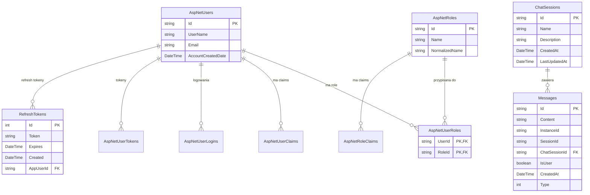

# 🗄️ Jiro Database Schema Documentation

## 📋 Spis treści

- [Przegląd architektury](#-przegląd-architektury)
- [Tabele systemu Identity](#-tabele-systemu-identity)
- [Tabele aplikacji Jiro](#-tabele-aplikacji-jiro)
- [Relacje między tabelami](#-relacje-między-tabelami)
- [Diagram ERD](#-diagram-erd)
- [Indeksy](#-indeksy)
- [Przykłady zapytań](#-przykłady-zapytań)

## 🏗️ Przegląd architektury

Baza danych Jiro wykorzystuje **ASP.NET Core Identity** do zarządzania użytkownikami i autoryzacją, oraz **Entity Framework Core** z podejściem Code-First do zarządzania schematem.

### **Główne komponenty:**

- **System Identity** - zarządzanie użytkownikami, rolami i tokenami
- **System konwersacji** - sesje czatów i wiadomości
- **System autoryzacji** - refresh tokeny i bezpieczeństwo

---

## 🔐 Tabele systemu Identity

### **AspNetUsers** - Użytkownicy systemu

**Bazuje na:** `AppUser : IdentityUser`

| Kolumna | Typ | Opis | Constraints |
|---------|-----|------|-------------|
| `Id` | `string` | Unikalny identyfikator użytkownika | **PK**, NOT NULL |
| `UserName` | `string(256)` | Nazwa użytkownika | UNIQUE |
| `NormalizedUserName` | `string(256)` | Znormalizowana nazwa (wielkie litery) | UNIQUE, INDEX |
| `Email` | `string(256)` | Adres email | |
| `NormalizedEmail` | `string(256)` | Znormalizowany email | INDEX |
| `EmailConfirmed` | `boolean` | Czy email został potwierdzony | NOT NULL |
| `PasswordHash` | `string` | Hash hasła | |
| `SecurityStamp` | `string` | Stempel bezpieczeństwa | |
| `ConcurrencyStamp` | `string` | Wersjonowanie optymistyczne | |
| `PhoneNumber` | `string` | Numer telefonu | |
| `PhoneNumberConfirmed` | `boolean` | Czy telefon został potwierdzony | NOT NULL |
| `TwoFactorEnabled` | `boolean` | Czy włączona 2FA | NOT NULL |
| `LockoutEnd` | `DateTimeOffset?` | Data końca blokady | |
| `LockoutEnabled` | `boolean` | Czy możliwa blokada | NOT NULL |
| `AccessFailedCount` | `int` | Liczba nieudanych logowań | NOT NULL |
| `AccountCreatedDate` | `DateTime` | Data utworzenia konta | NOT NULL |

### **AspNetRoles** - Role systemu

**Bazuje na:** `AppRole : IdentityRole`

| Kolumna | Typ | Opis | Constraints |
|---------|-----|------|-------------|
| `Id` | `string` | Unikalny identyfikator roli | **PK**, NOT NULL |
| `Name` | `string(256)` | Nazwa roli | |
| `NormalizedName` | `string(256)` | Znormalizowana nazwa | UNIQUE, INDEX |
| `ConcurrencyStamp` | `string` | Wersjonowanie optymistyczne | |

### **AspNetUserRoles** - Relacja użytkownik-rola

**Bazuje na:** `AppUserRole : IdentityUserRole<string>`

| Kolumna | Typ | Opis | Constraints |
|---------|-----|------|-------------|
| `UserId` | `string` | ID użytkownika | **PK**, **FK** → AspNetUsers.Id |
| `RoleId` | `string` | ID roli | **PK**, **FK** → AspNetRoles.Id |

### **AspNetUserClaims** - Claims użytkowników

**System Identity**

| Kolumna | Typ | Opis | Constraints |
|---------|-----|------|-------------|
| `Id` | `int` | Unikalny identyfikator | **PK**, IDENTITY |
| `UserId` | `string` | ID użytkownika | **FK** → AspNetUsers.Id |
| `ClaimType` | `string` | Typ claim | |
| `ClaimValue` | `string` | Wartość claim | |

### **AspNetRoleClaims** - Claims ról

**System Identity**

| Kolumna | Typ | Opis | Constraints |
|---------|-----|------|-------------|
| `Id` | `int` | Unikalny identyfikator | **PK**, IDENTITY |
| `RoleId` | `string` | ID roli | **FK** → AspNetRoles.Id |
| `ClaimType` | `string` | Typ claim | |
| `ClaimValue` | `string` | Wartość claim | |

### **AspNetUserLogins** - Zewnętrzne logowania

**System Identity**

| Kolumna | Typ | Opis | Constraints |
|---------|-----|------|-------------|
| `LoginProvider` | `string` | Dostawca logowania | **PK** |
| `ProviderKey` | `string` | Klucz dostawcy | **PK** |
| `ProviderDisplayName` | `string` | Nazwa wyświetlana | |
| `UserId` | `string` | ID użytkownika | **FK** → AspNetUsers.Id |

### **AspNetUserTokens** - Tokeny użytkowników

**System Identity**

| Kolumna | Typ | Opis | Constraints |
|---------|-----|------|-------------|
| `UserId` | `string` | ID użytkownika | **PK**, **FK** → AspNetUsers.Id |
| `LoginProvider` | `string` | Dostawca logowania | **PK** |
| `Name` | `string` | Nazwa tokenu | **PK** |
| `Value` | `string` | Wartość tokenu | |

---

## 💬 Tabele aplikacji Jiro

### **ChatSessions** - Sesje konwersacji

**Model:** `ChatSession : DbModel<string>`

| Kolumna | Typ | Opis | Constraints |
|---------|-----|------|-------------|
| `Id` | `string` | Unikalny identyfikator sesji | **PK**, NOT NULL |
| `Name` | `string` | Nazwa sesji | NOT NULL |
| `Description` | `string` | Opis sesji | NOT NULL |
| `CreatedAt` | `DateTime` | Data utworzenia | NOT NULL |
| `LastUpdatedAt` | `DateTime` | Data ostatniej aktualizacji | NOT NULL |

**Relacje:**

- `1:N` → Messages (jedna sesja ma wiele wiadomości)

### **Messages** - Wiadomości w konwersacjach

**Model:** `Message : DbModel<string>`

| Kolumna | Typ | Opis | Constraints |
|---------|-----|------|-------------|
| `Id` | `string` | Unikalny identyfikator wiadomości | **PK**, NOT NULL |
| `Content` | `string` | Treść wiadomości | NOT NULL |
| `InstanceId` | `string` | ID instancji użytkownika | NOT NULL |
| `SessionId` | `string` | ID sesji (duplikat ChatSessionId) | NOT NULL |
| `ChatSessionId` | `string` | ID sesji czatu | **FK** → ChatSessions.Id |
| `IsUser` | `boolean` | Czy wiadomość od użytkownika | NOT NULL |
| `CreatedAt` | `DateTime` | Data utworzenia | NOT NULL |
| `Type` | `int` | Typ wiadomości (enum) | NOT NULL |

**Enum MessageType:**

- `0` - Text (tekst)
- `1` - Graph (wykres)
- `2` - Image (obraz)

**Relacje:**

- `N:1` → ChatSessions (wiele wiadomości należy do jednej sesji)

### **RefreshTokens** - Tokeny odświeżania

**Model:** `RefreshToken : DbModel<int>`

| Kolumna | Typ | Opis | Constraints |
|---------|-----|------|-------------|
| `Id` | `int` | Unikalny identyfikator | **PK**, IDENTITY |
| `Token` | `string` | Token odświeżania | |
| `Expires` | `DateTime` | Data wygaśnięcia | NOT NULL |
| `Created` | `DateTime` | Data utworzenia | NOT NULL |
| `CreatedByIp` | `string` | IP tworzące token | |
| `Revoked` | `DateTime?` | Data unieważnienia | |
| `RevokedByIp` | `string` | IP unieważniające | |
| `ReasonRevoked` | `string` | Powód unieważnienia | |
| `AppUserId` | `string` | ID właściciela tokenu | **FK** → AspNetUsers.Id |

**Właściwości obliczane (nie w bazie):**

- `IsExpired` - czy token wygasł
- `IsRevoked` - czy token został unieważniony  
- `IsActive` - czy token jest aktywny

**Relacje:**

- `N:1` → AspNetUsers (wiele tokenów należy do jednego użytkownika)

---

## 🔗 Relacje między tabelami

### **Diagram relacji:**



### **Kluczowe relacje:**

1. **AspNetUsers ↔ AspNetUserRoles ↔ AspNetRoles**
   - Relacja many-to-many przez tabelę pośrednią
   - Umożliwia przypisanie wielu ról do użytkownika

2. **AspNetUsers → RefreshTokens**
   - Relacja one-to-many
   - Jeden użytkownik może mieć wiele aktywnych tokenów

3. **ChatSessions → Messages**
   - Relacja one-to-many
   - Jedna sesja zawiera wiele wiadomości

4. **Brak bezpośredniej relacji User → ChatSession**
   - Identyfikacja przez `InstanceId` w wiadomościach
   - Elastyczne podejście dla różnych typów klientów

---

## 📊 Diagram ERD

```sql
-- Schemat relacyjny bazy danych Jiro

-- SYSTEM IDENTITY
CREATE TABLE AspNetUsers (
    Id TEXT PRIMARY KEY,
    UserName TEXT(256),
    NormalizedUserName TEXT(256) UNIQUE,
    Email TEXT(256),
    NormalizedEmail TEXT(256),
    EmailConfirmed INTEGER NOT NULL,
    PasswordHash TEXT,
    SecurityStamp TEXT,
    ConcurrencyStamp TEXT,
    PhoneNumber TEXT,
    PhoneNumberConfirmed INTEGER NOT NULL,
    TwoFactorEnabled INTEGER NOT NULL,
    LockoutEnd TEXT,
    LockoutEnabled INTEGER NOT NULL,
    AccessFailedCount INTEGER NOT NULL,
    AccountCreatedDate TEXT NOT NULL
);

CREATE TABLE AspNetRoles (
    Id TEXT PRIMARY KEY,
    Name TEXT(256),
    NormalizedName TEXT(256) UNIQUE,
    ConcurrencyStamp TEXT
);

CREATE TABLE AspNetUserRoles (
    UserId TEXT NOT NULL,
    RoleId TEXT NOT NULL,
    PRIMARY KEY (UserId, RoleId),
    FOREIGN KEY (UserId) REFERENCES AspNetUsers(Id) ON DELETE CASCADE,
    FOREIGN KEY (RoleId) REFERENCES AspNetRoles(Id) ON DELETE CASCADE
);

-- APLIKACJA JIRO
CREATE TABLE ChatSessions (
    Id TEXT PRIMARY KEY,
    Name TEXT NOT NULL,
    Description TEXT NOT NULL,
    CreatedAt TEXT NOT NULL,
    LastUpdatedAt TEXT NOT NULL
);

CREATE TABLE Messages (
    Id TEXT PRIMARY KEY,
    Content TEXT NOT NULL,
    InstanceId TEXT NOT NULL,
    SessionId TEXT NOT NULL,
    ChatSessionId TEXT,
    IsUser INTEGER NOT NULL,
    CreatedAt TEXT NOT NULL,
    Type INTEGER NOT NULL,
    FOREIGN KEY (ChatSessionId) REFERENCES ChatSessions(Id)
);

CREATE TABLE RefreshTokens (
    Id INTEGER PRIMARY KEY AUTOINCREMENT,
    Token TEXT,
    Expires TEXT NOT NULL,
    Created TEXT NOT NULL,
    CreatedByIp TEXT,
    Revoked TEXT,
    RevokedByIp TEXT,
    ReasonRevoked TEXT,
    AppUserId TEXT,
    FOREIGN KEY (AppUserId) REFERENCES AspNetUsers(Id)
);
```

---

## 🔍 Indeksy

### **Indeksy automatycznie utworzone przez Identity:**

```sql
-- Indeksy użytkowników
CREATE UNIQUE INDEX UserNameIndex ON AspNetUsers (NormalizedUserName);
CREATE INDEX EmailIndex ON AspNetUsers (NormalizedEmail);

-- Indeksy ról
CREATE UNIQUE INDEX RoleNameIndex ON AspNetRoles (NormalizedName);

-- Indeksy relacji
CREATE INDEX IX_AspNetUserRoles_RoleId ON AspNetUserRoles (RoleId);
CREATE INDEX IX_AspNetUserClaims_UserId ON AspNetUserClaims (UserId);
CREATE INDEX IX_AspNetRoleClaims_RoleId ON AspNetRoleClaims (RoleId);
CREATE INDEX IX_AspNetUserLogins_UserId ON AspNetUserLogins (UserId);
```

### **Indeksy aplikacji Jiro:**

```sql
-- Indeksy dla wydajności zapytań
CREATE INDEX IX_Messages_ChatSessionId ON Messages (ChatSessionId);
CREATE INDEX IX_Messages_InstanceId ON Messages (InstanceId);
CREATE INDEX IX_Messages_CreatedAt ON Messages (CreatedAt);
CREATE INDEX IX_RefreshTokens_AppUserId ON RefreshTokens (AppUserId);
CREATE INDEX IX_RefreshTokens_Token ON RefreshTokens (Token);
CREATE INDEX IX_ChatSessions_CreatedAt ON ChatSessions (CreatedAt);
```

---

## 💡 Przykłady zapytań

### **Pobieranie sesji użytkownika z wiadomościami:**

```sql
-- Wszystkie sesje dla konkretnego użytkownika (instance)
SELECT DISTINCT cs.Id, cs.Name, cs.Description, cs.CreatedAt, cs.LastUpdatedAt
FROM ChatSessions cs
INNER JOIN Messages m ON cs.Id = m.ChatSessionId
WHERE m.InstanceId = 'user-instance-id'
ORDER BY cs.LastUpdatedAt DESC;

-- Wiadomości dla konkretnej sesji
SELECT Id, Content, IsUser, CreatedAt, Type
FROM Messages
WHERE ChatSessionId = 'session-id'
ORDER BY CreatedAt ASC;
```

### **Zarządzanie tokenami odświeżania:**

```sql
-- Aktywne tokeny użytkownika
SELECT Id, Token, Expires, Created
FROM RefreshTokens
WHERE AppUserId = 'user-id'
  AND Revoked IS NULL
  AND Expires > datetime('now')
ORDER BY Created DESC;

-- Unieważnienie wszystkich tokenów użytkownika
UPDATE RefreshTokens 
SET Revoked = datetime('now'),
    RevokedByIp = 'admin-action',
    ReasonRevoked = 'security-logout'
WHERE AppUserId = 'user-id' 
  AND Revoked IS NULL;
```

### **Statystyki konwersacji:**

```sql
-- Statystyki wiadomości dla użytkownika
SELECT 
    COUNT(DISTINCT m.ChatSessionId) as TotalSessions,
    COUNT(m.Id) as TotalMessages,
    COUNT(CASE WHEN m.IsUser = 1 THEN 1 END) as UserMessages,
    COUNT(CASE WHEN m.IsUser = 0 THEN 1 END) as BotMessages,
    MIN(m.CreatedAt) as FirstMessage,
    MAX(m.CreatedAt) as LastMessage
FROM Messages m
WHERE m.InstanceId = 'user-instance-id';

-- Najaktywniejsze sesje
SELECT 
    cs.Id,
    cs.Name,
    COUNT(m.Id) as MessageCount,
    cs.LastUpdatedAt
FROM ChatSessions cs
INNER JOIN Messages m ON cs.Id = m.ChatSessionId
GROUP BY cs.Id, cs.Name, cs.LastUpdatedAt
ORDER BY MessageCount DESC, cs.LastUpdatedAt DESC
LIMIT 10;
```

### **Użytkownicy i role:**

```sql
-- Użytkownik z rolami
SELECT 
    u.Id,
    u.UserName,
    u.Email,
    u.AccountCreatedDate,
    GROUP_CONCAT(r.Name) as Roles
FROM AspNetUsers u
LEFT JOIN AspNetUserRoles ur ON u.Id = ur.UserId
LEFT JOIN AspNetRoles r ON ur.RoleId = r.Id
WHERE u.Id = 'user-id'
GROUP BY u.Id, u.UserName, u.Email, u.AccountCreatedDate;

-- Wszyscy administratorzy
SELECT u.Id, u.UserName, u.Email
FROM AspNetUsers u
INNER JOIN AspNetUserRoles ur ON u.Id = ur.UserId
INNER JOIN AspNetRoles r ON ur.RoleId = r.Id
WHERE r.NormalizedName = 'ADMIN';
```

---

## 🛡️ Bezpieczeństwo i optymalizacja

### **Najlepsze praktyki:**

1. **Indeksy** - wszystkie kolumny używane w WHERE, JOIN i ORDER BY
2. **Soft delete** - możliwość dodania `IsDeleted` dla bezpiecznego usuwania
3. **Audyt** - śledzenie zmian przez `CreatedAt`, `LastUpdatedAt`
4. **Partycjonowanie** - dla dużych tabel Messages według daty
5. **Archiwizacja** - przenoszenie starych sesji do tabel archiwalnych

### **Monitoring wydajności:**

```sql
-- Najwolniejsze zapytania (przykład SQLite)
EXPLAIN QUERY PLAN 
SELECT * FROM Messages 
WHERE InstanceId = 'user-id' 
ORDER BY CreatedAt DESC 
LIMIT 50;
```

---

**Schemat bazy danych Jiro zapewnia:**

- ✅ Pełną integrację z ASP.NET Core Identity
- ✅ Efektywne zarządzanie sesjami konwersacji  
- ✅ Bezpieczne przechowywanie tokenów
- ✅ Skalowalność dla dużej liczby wiadomości
- ✅ Elastyczność dla różnych typów klientów
